# Module 11 : Database fundamentals and relational and relational data modeling

**What is a Database?**

A database is a structured collection of related data, organized for efficient storage, retrieval, and management. It allows users to store data in an organized manner, easily access it when needed, and manage it effectively.

**What is Data?**

Data is raw facts that can be recorded in various forms, such as:

- Images
    
- Videos
    
- Audio
    
- Text
    

In today's digital era, data is everywhere and plays a crucial role in modern applications and systems (e.g., social media platforms like Facebook, YouTube, Instagram).

**What is Information?**

Information is processed and organized data that provides meaningful context, insight, or knowledge. When raw data is processed, it becomes useful information that can guide decision-making.

**Data vs Information Process**

The flowchart below illustrates how raw data is processed to generate meaningful information:

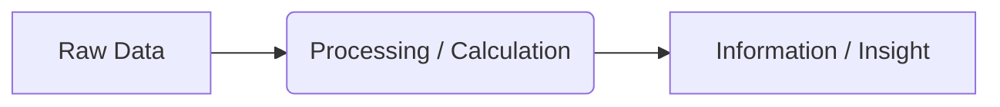

**Example:**

- **Data:** A list of temperature readings for a city over 5 days: `85, 90, 88, 92, 87`
    
- **Process:** Calculate the average temperature by adding the readings and dividing by 5.
    
- **Information:** The average temperature is `88.4` degrees, providing a meaningful insight into the overall weather patterns.

## Why Do We Need a Database?

A common question is:

> We already have a computer, an operating system, and a file system. Since files can store data, why do we need databases at all?

Before databases existed, applications used the file system directly to store data. This period is often called the **pre-database era** (around the 1960s).

Although storing data in files works, file systems have several limitations that become serious problems as applications grow. To solve these problems, **DBMS (Database Management System)** was introduced.

### What is DBMS?

**DBMS = Database Management System**

A DBMS is software that manages databases and provides an efficient way to store, retrieve, update, and secure data.

Instead of directly interacting with files, applications interact with the DBMS.

---

## How Data is Stored in a File System

Suppose we want to store student information:

|Serial|Name|Address|
|---|---|---|
|1|Arish|Sylhet|
|2|Rahim|Dhaka|

In a file system, we might save this data as:

- Text file (`.txt`)
    
- CSV file (`.csv`)
    
- Excel file (`.xlsx`)
    

Eventually, these files are stored on the computer's hard drive.


---

## Drawbacks of File Systems

### Multiple File Formats

The same type of data can be stored in many different formats.

For example:

- TXT
    
- CSV
    
- XLSX
    

This creates problems because each format may require different code to process.

In older systems, developers often had to write separate programs for each file format.

#### Problem

- Difficult to combine data from different formats
    
- More development effort
    
- Harder maintenance
    

---

### Data Redundancy

**Data Redundancy = Duplicate Data**

Suppose one file stores:

|Name|Address|
|---|---|
|Arish|Sylhet|

Another file stores:

|Name|Age|Address|
|---|---|---|
|Arish|20|Sylhet|

The address is stored in multiple places.

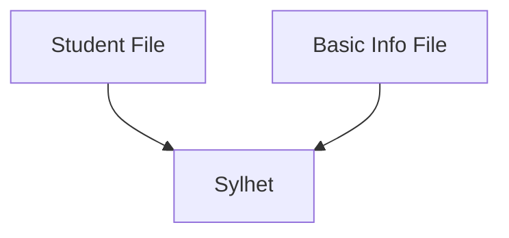

As the number of files grows, the amount of duplicated data increases significantly.

#### Problems

- More storage usage
    
- Harder maintenance
    
- Higher chance of mistakes
    

---

### Data Inconsistency

Data redundancy eventually leads to **data inconsistency**.

Suppose Arish moves from Sylhet to Dhaka.

You update one file:

|Name|Address|
|---|---|
|Arish|Dhaka|

But forget to update another file:

|Name|Address|
|---|---|
|Arish|Sylhet|

Now the same student has two different addresses.

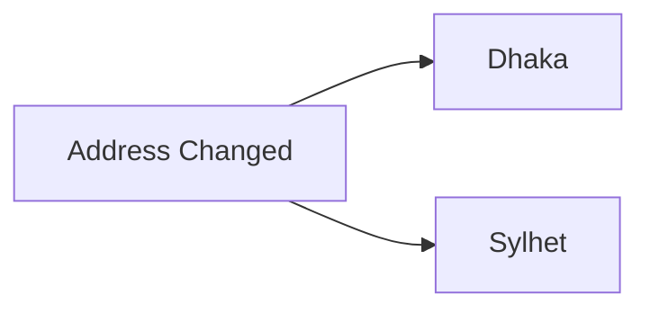

This is called **data inconsistency**.

#### Problems

- Incorrect information
    
- Conflicting records
    
- Reduced reliability
    

---

### Difficult Data Sharing

Suppose you share a file with 10 people.

Later, a student's address changes.

You update your own copy, but the other 9 copies still contain old information.

Some people may update their files, while others may forget.

As a result, different versions of the same data start appearing everywhere.

This creates even more inconsistency.

---

### No Proper Concurrency Control

**Concurrency** means multiple users trying to access or modify the same data simultaneously.

Example:

- User A updates a record
    
- User B updates the same record at the same time
    

Questions arise:

- Which update should happen first?
    
- Can both update together?
    
- What happens if both save different values?
    

File systems do not provide advanced mechanisms to handle these situations.

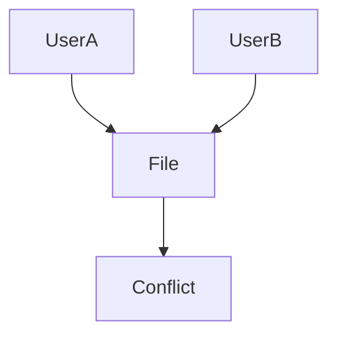

This can lead to conflicts and corrupted data.

---

### Security Limitations

File systems provide very limited access control.

If someone gets access to a file, they usually get access to the entire file.

Example:

|Column|Access|
|---|---|
|Name|Allowed|
|Address|Restricted|

A file system cannot easily enforce this level of control.

A DBMS can.

With a database, we can:

- Allow users to view specific columns
    
- Hide sensitive data
    
- Allow read-only access
    
- Prevent updates and deletes
    
- Define role-based permissions
    

This is known as **fine-grained access control**.

---

## How DBMS Solves These Problems

Instead of directly working with files, applications communicate with a DBMS.

When data needs to be stored:

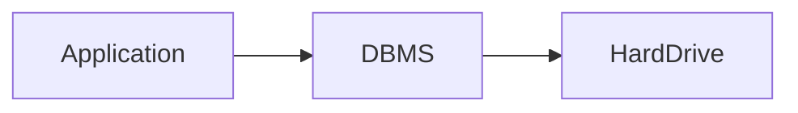

When data needs to be retrieved:

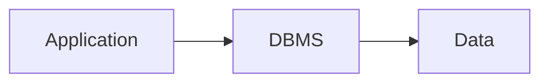

The DBMS handles:

- File organization
    
- Storage format
    
- Data retrieval
    
- Performance optimization
    
- Security
    
- Concurrency control
    
- Consistency management
    

Developers only focus on working with data.

The DBMS handles everything else behind the scenes.

---

## File System vs DBMS

|Feature|File System|DBMS|
|---|---|---|
|Data Redundancy|High|Low|
|Data Consistency|Difficult|Maintained|
|Concurrency Control|Poor|Strong|
|Security|Basic|Advanced|
|Data Retrieval|Manual|Efficient|
|Scalability|Limited|High|
|Data Relationships|Difficult|Built-in|

---

## Popular Types of DBMS

### Relational Databases (RDBMS)

Store data in tables with rows and columns.

Examples:

- MySQL
    
- PostgreSQL
    
- SQLite
    
- SQL Server
    

### Document Databases

Store data as documents (usually JSON-like structures).

Examples:

- MongoDB
    
- DynamoDB
    

### Key-Value Databases

Store data as key-value pairs.

Example:

- Redis
    

---

## Summary

File systems can store data, but they introduce several problems:

- Multiple file formats
    
- Data redundancy
    
- Data inconsistency
    
- Difficult sharing
    
- Weak concurrency handling
    
- Limited security
    

To solve these issues, **Database Management Systems (DBMS)** were introduced.

A DBMS sits between the application and the hard drive, managing storage, retrieval, security, consistency, and concurrency efficiently.

That is why modern applications use databases instead of directly storing data in files.

## Database Models and Why Relational Databases Became So Popular

In this lesson, we'll discuss different database models and understand why the **Relational Model** became the most popular and widely used database model.

### Evolution of Database Models

Database models did not appear in the following order:

1. Hierarchical Model
    
2. Network Model
    
3. Relational Model
    
4. Document-Based Model
    
5. Key-Value Model
    

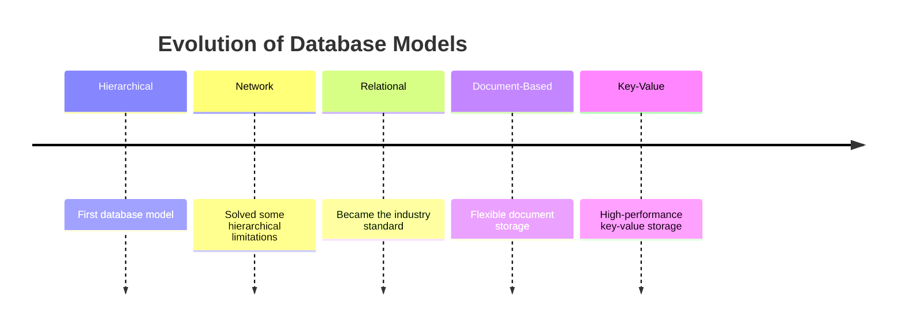

---

## Hierarchical Model

The **Hierarchical Model** was one of the earliest database models.

In this model, data relationships were represented as a **tree structure**, where every child node had exactly one parent.

### Example

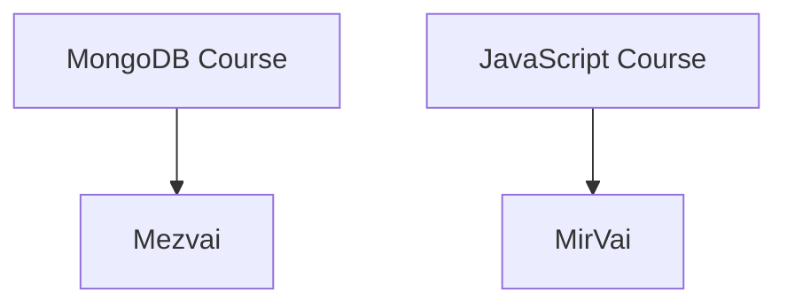

This model works well when relationships naturally form a hierarchy.

### Main Limitation

A child node could not have multiple parents.

Suppose:

- Mejbhai teaches Express
    
- Mir Vai also teaches Express
    

The hierarchical model cannot represent this relationship because a node can only have one parent.

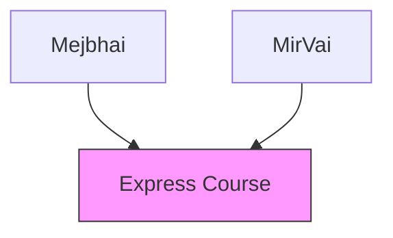

This relationship is not supported in a pure hierarchical model.

---

## Network Model

To solve the limitations of the hierarchical model, the **Network Model** was introduced.

Unlike the hierarchical model, a node could have multiple parents.

### Example

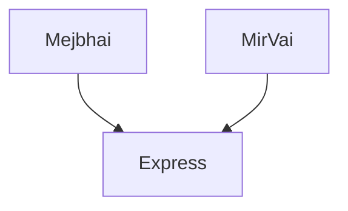

Now the relationship can be represented correctly.

### Advantages

- Supports multiple parent-child relationships
    
- More flexible than the hierarchical model
    

### Drawbacks

Despite being more powerful, it introduced new problems.

#### Complex Data Traversal

To find data, the system often had to traverse multiple nodes and relationships.

As data grew larger, finding information became increasingly complex.

#### Complex Schema Design

Defining and maintaining relationships was difficult.

#### Lack of Standardization

There was no standard way to interact with the database.

Different vendors implemented different approaches.

As a result:

- Learning was difficult
    
- Development was difficult
    
- Portability was poor
    

---

## Relational Model

The **Relational Model** solved many of the problems of previous database models.

Instead of trees and graphs, data is stored in **tables**.

### User Table

|UID|Name|Address|Phone|
|---|---|---|---|
|1|Nadira|Dhaka|017xxxx|
|2|Arish|Sylhet|018xxxx|
|3|Rahil|Chattogram|019xxxx|
|4|Arish|Cumilla|016xxxx|

### Order Table

|OID|Product|Price|UID|
|---|---|---|---|
|1|Product A|500|2|
|2|Product B|800|1|
|3|Product C|1200|3|

---

## Unique Identifiers (IDs)

In relational databases, each row is usually assigned a unique identifier.

Examples:

- `UID` → User ID
    
- `OID` → Order ID
    

These IDs help us uniquely identify a record.

### Why IDs Are Important

Notice that there are two users named **Arish**.

|UID|Name|
|---|---|
|2|Arish|
|4|Arish|

If we search by name, we may get multiple results.

However, if we search by:

```txt
UID = 2
```

We get exactly one record.

This removes ambiguity and makes data retrieval reliable.

---

## How Relationships Work in Relational Databases

A common question is:

> Earlier models showed relationships using parent-child trees. How are relationships represented in relational databases?

The answer is: **Keys**.

### Relationship Example

#### Users

|UID|Name|
|---|---|
|1|Nadira|
|2|Arish|
|3|Rahil|

#### Orders

|OID|Product|UID|
|---|---|---|
|1|Product A|2|
|2|Product B|1|
|3|Product C|3|

The `UID` inside the Orders table points to a user in the Users table.

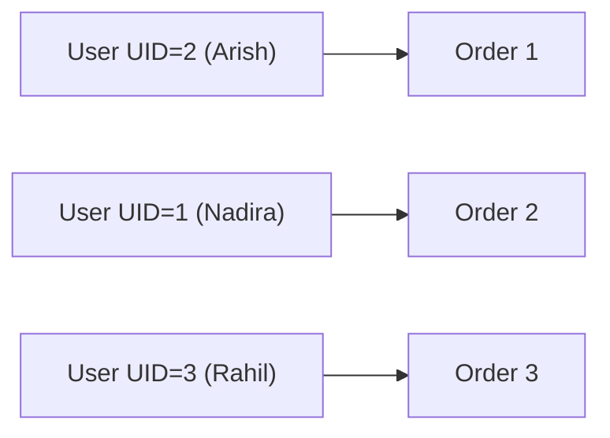

### Example Query Logic

Suppose we look at:

```txt
Order 1
UID = 2
```

We go to the User table and find:

```txt
UID = 2 → Arish
```

Therefore:

```txt
Order 1 belongs to Arish
```

This is how relationships are maintained in relational databases.

---

## Why Relational Databases Became Popular

### Table-Based Structure

Data is easy to understand because everything is organized into rows and columns.

### Unique Identification

Each row can be uniquely identified using IDs.

### Relationships Through Keys

Relationships are created using keys instead of complex tree traversals.

### Faster Data Retrieval

Databases can create indexes on keys.

Because of indexing, the database can locate data quickly without traversing every record.

### Easier Schema Design

Tables, columns, and relationships are easier to design and maintain.

### Standardized Query Language

Relational databases introduced SQL (Structured Query Language).

This gave developers a standard way to:

- Store data
    
- Retrieve data
    
- Update data
    
- Delete data
    

Regardless of whether they used MySQL, PostgreSQL, SQLite, or SQL Server.

---

## Comparison of Database Models

|Feature|Hierarchical|Network|Relational|
|---|---|---|---|
|Tree Structure|✅|❌|❌|
|Multiple Parents|❌|✅|✅|
|Easy Relationships|❌|⚠️|✅|
|Easy Data Retrieval|❌|⚠️|✅|
|Standard Query Language|❌|❌|✅|
|Scalability|⚠️|⚠️|✅|

---

## Summary

### Hierarchical Model

- Tree-based structure
    
- Child can only have one parent
    
- Limited flexibility
    

### Network Model

- Supports multiple parents
    
- More flexible
    
- Complex to manage
    
- No standard interaction method
    

### Relational Model

- Stores data in tables
    
- Uses unique identifiers (IDs)
    
- Creates relationships through keys
    
- Supports indexing
    
- Easier schema design
    
- Standardized through SQL
    

These advantages made the **Relational Model** the dominant database model used today.


## Anatomy of a Table in the Relational Model

One of the most important components of a **Relational Database** is the **Table**.

In the relational model, data is stored in a structured format using tables.

In this lesson, we'll learn the anatomy of a table and understand the terminology used in relational databases.

---

## Table (Relation)

In a relational database, data is stored in tables.

Example:

|ID|Name|Email|DOB|Phone|
|---|---|---|---|---|
|1|Arish|[arish@gmail.com](mailto:arish@gmail.com)|2000-01-15|017xxxx|
|2|Rahil|[rahil@gmail.com](mailto:rahil@gmail.com)|2001-03-20|018xxxx|

This structure is called a **Table**.

A table is also called a **Relation**.

Therefore:

```txt
Table = Relation
```

Both terms are interchangeable in relational database theory.

---

## Entity

A table usually represents an **Entity**.

An entity is a real-world or conceptual object that we want to store information about.

### Real-Life Entity Example

```txt
User
```

A User exists in the real world, so it is a real-life entity.

The table below represents the User entity:

|ID|Name|Email|
|---|---|---|
|1|Arish|[arish@gmail.com](mailto:arish@gmail.com)|
|2|Rahil|[rahil@gmail.com](mailto:rahil@gmail.com)|

---

### Conceptual (Imaginary) Entity Example

```txt
Order
```

An Order is not a physical object like a person.

However, it is still something we want to track and store information about.

Therefore, it is also considered an entity.

Example:

|Order ID|Product|Price|
|---|---|---|
|101|Laptop|50000|
|102|Phone|25000|

---

### Relationship Between Entity and Table

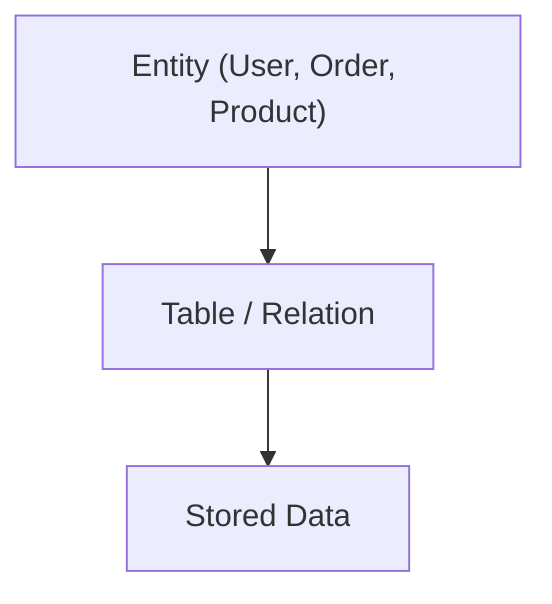

A table is simply the database representation of an entity.

---

## Columns (Attributes)

Consider the following table:

|ID|Name|Email|DOB|Phone|
|---|---|---|---|---|
|1|Arish|[arish@gmail.com](mailto:arish@gmail.com)|2000-01-15|017xxxx|

The vertical sections:

- ID
    
- Name
    
- Email
    
- DOB
    
- Phone
    

are called **Columns**.

Columns are also called **Attributes**.

```txt
Column = Attribute
```

Both terms mean the same thing.

### Example

|Column|Attribute|
|---|---|
|ID|ID|
|Name|Name|
|Email|Email|
|DOB|DOB|
|Phone|Phone|

---

## Domain and Constraints

Each column can define what type of data is allowed.

This restriction is called a **Constraint** or **Domain**.

---

### Example: Email Column

Suppose we have:

|Email|
|---|
|[arish@gmail.com](mailto:arish@gmail.com)|

The Email column should only accept email values.

Valid:

```txt
arish@gmail.com
rahil@yahoo.com
```

Invalid:

```txt
12345
hello
2024-05-01
```

So we can say:

```txt
Email Column Domain = Email Values
```

---

### Example: Date of Birth (DOB)

|DOB|
|---|
|2000-01-15|

Valid:

```txt
2000-01-15
1998-10-20
```

Invalid:

```txt
Hello
ABC
123XYZ
```

The column only accepts values that follow a valid date format.

---

### Domain Concept

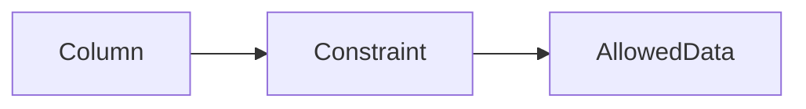

Examples:

|Column|Domain|
|---|---|
|Email|Email Format|
|DOB|Date Format|
|Age|Integer|
|Name|Text/String|

---

## Rows (Tuples / Records)

Consider the following table:

|ID|Name|Email|
|---|---|---|
|1|Arish|[arish@gmail.com](mailto:arish@gmail.com)|
|2|Rahil|[rahil@gmail.com](mailto:rahil@gmail.com)|
|3|Nadira|[nadira@gmail.com](mailto:nadira@gmail.com)|

Each horizontal line is called a **Row**.

Example:

|ID|Name|Email|
|---|---|---|
|1|Arish|[arish@gmail.com](mailto:arish@gmail.com)|

This single line is a row.

Rows are also called:

- Tuple
    
- Record
    

```txt
Row = Tuple = Record
```

These terms are often used interchangeably.

---

### Example

This is one row:

|ID|Name|Email|
|---|---|---|
|2|Rahil|[rahil@gmail.com](mailto:rahil@gmail.com)|

We can call it:

- A Row
    
- A Tuple
    
- A Record
    

All three are correct.

---

## Visualizing Table Components

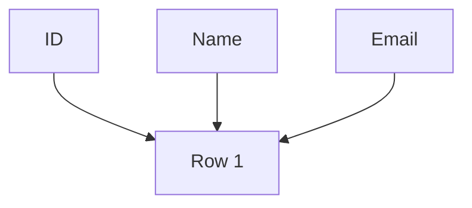

- Vertical structure → Columns (Attributes)
    
- Horizontal structure → Rows (Tuples / Records)
    

---

## Cardinality

Cardinality refers to the total number of rows in a table.

### Example

|ID|Name|
|---|---|
|1|Arish|
|2|Rahil|
|3|Nadira|
|4|Fahim|

This table contains:

```txt
4 Rows
```

Therefore:

```txt
Cardinality = 4
```

---

### Another Example

|ID|Name|
|---|---|
|1|Arish|
|2|Rahil|
|3|Nadira|
|4|Fahim|
|5|Hasan|
|6|Karim|

Here:

```txt
Cardinality = 6
```

A higher cardinality means the table contains more records.

---

## Degree

Degree refers to the total number of columns in a table.

Consider:

|ID|Name|Email|DOB|Phone|
|---|---|---|---|---|

There are 5 columns.

Therefore:

```txt
Degree = 5
```

---

### Another Example

|ID|Name|Email|
|---|---|---|

This table contains:

```txt
3 Columns
```

Therefore:

```txt
Degree = 3
```

---

## Cardinality vs Degree

|Term|Meaning|
|---|---|
|Cardinality|Number of Rows|
|Degree|Number of Columns|

### Example

|ID|Name|Email|
|---|---|---|
|1|Arish|[arish@gmail.com](mailto:arish@gmail.com)|
|2|Rahil|[rahil@gmail.com](mailto:rahil@gmail.com)|
|3|Nadira|[nadira@gmail.com](mailto:nadira@gmail.com)|
|4|Fahim|[fahim@gmail.com](mailto:fahim@gmail.com)|

- Number of rows = 4
    
- Number of columns = 3
    

Therefore:

```txt
Cardinality = 4
Degree = 3
```

---

## Summary

### Table / Relation

- Stores data in relational databases
    
- Represents an entity
    

### Entity

- Real-world or conceptual object
    
- Examples:
    
    - User
        
    - Product
        
    - Order
        

### Column / Attribute

- Vertical part of a table
    
- Describes a property of an entity
    

### Domain / Constraint

- Defines what type of data can be stored in a column
    

### Row / Tuple / Record

- Horizontal part of a table
    
- Represents one complete piece of data
    

### Cardinality

- Total number of rows in a table
    

### Degree

- Total number of columns in a table
    

### Important Equivalences

```txt
Table = Relation

Column = Attribute

Row = Tuple = Record

Cardinality = Number of Rows

Degree = Number of Columns
```


---
## Candidate Key

This video explains candidate keys and builds the idea using set theory concepts like subset and proper subset.

---

## Set, Subset, Proper Subset (foundation)

Let,

**A = {1, 2, 3}**

### Subset

A subset can include all elements or some elements of the original set.

Examples:

- {1}
    
- {2}
    
- {1, 2}
    
- {1, 2, 3}
    
- ∅
    

So:

- {1, 2, 3} is also a subset of itself
    

---

### Proper Subset

A proper subset must have **fewer elements than the original set**.

Examples:

- {1} ⊂ {1, 2, 3}
    
- {1, 2} ⊂ {1, 2, 3}
    
- ∅ ⊂ {1, 2, 3}
    

Important:

- A set is **not** a proper subset of itself
    

Rule:

- Every proper subset is a subset
    
- But not every subset is a proper subset
    

---

## Candidate Key Definition

A candidate key is:

> A super key whose proper subset is not a super key

Or more simply:

> A minimal super key

---

## Meaning in simple terms

- Super key → can uniquely identify a row
    
- Candidate key → uniquely identifies a row, and cannot be reduced further
    

If you remove any attribute and it still remains unique → it is NOT a candidate key.

---

## Example Table

User table:

| UID | Name | Email | Gender |

---

## Super Key examples (from lecture)

- UID
    
- Email
    
- UID + Name
    
- UID + Email
    
- Name + Gender
    

---

## Checking Candidate Keys

### 1. UID

Set: {UID}

Proper subset:

- ∅
    

Since ∅ is not a super key:

- UID is a candidate key ✔
    

---

### 2. Email

Assuming email is unique and not null:

Proper subset:

- ∅
    

Not a super key → valid

So:

- Email is a candidate key ✔
    

---

### 3. UID + Name

Set: {UID, Name}

Proper subsets include:

- {UID}
    
- {Name}
    
- ∅
    

Problem:

- {UID} is already a super key
    

So:

- UID + Name is NOT a candidate key ✘
    

---

### 4. UID + Email

Problem:

- UID alone is already a super key
    
- Email alone can also be a super key
    

So:

- UID + Email is NOT a candidate key ✘
    

---

### 5. Name + Gender

Set: {Name, Gender}

Proper subsets:

- {Name}
    
- {Gender}
    
- ∅
    

Check:

- None of these are super keys (in this dataset)
    

So:

- Name + Gender is a candidate key (only for this dataset) ✔
    

Important:

- This may fail in real systems if duplicates exist
    

---

## Key Insight

Candidate keys are **data-dependent**:

- They are valid only if they guarantee uniqueness in the actual dataset
    
- Not just theoretical combinations
    

---

## Why “Minimal Super Key”

Because:

- A candidate key cannot be reduced further
    
- If any subset still works as a super key → it is not minimal
    

---

## Primary Key Relation

- Candidate keys = all possible unique minimal identifiers
    
- Primary key = one selected candidate key
    

Selection criteria:

- smallest
    
- stable
    
- least likely to change
    

---

## Flow

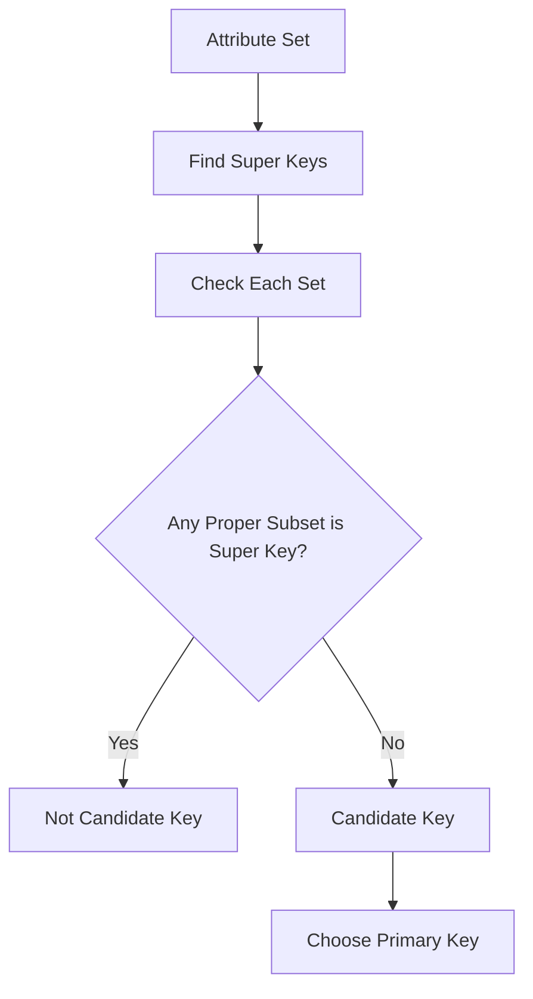

## Database Keys: Primary, Alternate, Composite, Simple

### Primary Key

Primary key is a **single chosen candidate key** used to uniquely identify each record in a table.

From the candidate keys, one is selected as the main identifier.

Example from the video:

- UID is chosen as Primary Key
    

Rules:

- Must be **unique**
    
- Must be **NOT NULL**
    
- Must be **stable (never changing)**
    

Reason UID works:

- System-generated
    
- Always present
    
- Never changes over time
    

So:

- UID → Primary Key
    

---

### Alternate Key

Alternate keys are the **candidate keys that were NOT selected as the primary key**.

Example from the video:  
If UID is chosen as primary key:

- Email → Alternate Key
    
- Name + Gender → Alternate Key (if it was a candidate key)
    

Meaning:

- They were valid candidate keys
    
- Just not selected as primary
    

---

### Composite Key

A composite key is a **candidate key made using two or more attributes together** to uniquely identify a record.

Example from the video:

- Name + Gender → Composite Key
    

Important idea:

- Multiple columns together form uniqueness
    
- Individually they may not be unique
    

---

### Simple Key

Simple key is the opposite of composite key.

Definition:

- A key made using **only one attribute**
    

Example idea from the video:

- UID → Simple Key
    
- Email → Simple Key (if unique + not null)
    

---

### Key Relationships (Summary)

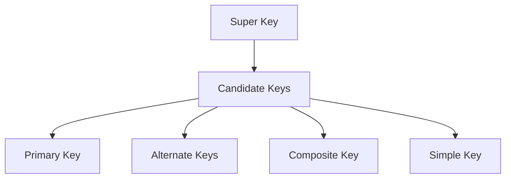

---

### Core Intuition

- Candidate keys = all possible unique identifiers
    
- Primary key = chosen one
    
- Alternate = remaining ones
    
- Composite = multi-attribute key
    
- Simple = single-attribute key

## Foreign Key (Relational Model Relationship Builder)

### Core Idea

Foreign key is a **key used to connect two tables** in a relational database.

It links:

- one table’s **primary key**  
    to
    
- another table’s column
    

So basically:

> Foreign key = relationship bridge between tables

---

### Example: Customer → Order Relationship

From the video example:

#### Customer Table

- Attributes: `customer_id`, `name`, `email`, `phone`
    
- Primary Key: `customer_id`
    

Example data:

- 1 → Alice
    
- 2 → Bob
    

So:

- `customer_id` uniquely identifies each customer
    

---

#### Order Table

Example structure:

- `order_id`
    
- `customer_id`
    
- `product`
    
- `price`
    

Now each order must know:

> Who placed this order?

So we store:

- Order 101 → customer_id = 1
    
- Order 102 → customer_id = 2
    

---

### How Relationship Works

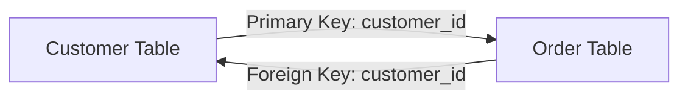

Meaning:

- Order table stores `customer_id`
    
- That `customer_id` comes from Customer table
    
- So we can trace ownership of each order
    

---

### Foreign Key Definition

Foreign key is:

- an attribute in one table
    
- that refers to the primary key of another table
    
- and creates a relationship between tables
    

---

### Why Foreign Key Exists

Without foreign key:

- Orders and customers become disconnected
    
- You cannot know who placed what order
    

With foreign key:

- Data becomes relational
    
- Tables can be joined logically
    
- Integrity is maintained
    

---

### Key Intuition

- Primary key = identity inside a table
    
- Foreign key = reference to another table’s identity
    
- Together they build relational structure
    

---

### Final Mental Model

- Customer table = source of identity
    
- Order table = depends on Customer
    
- Foreign key = pointer linking both
    

If foreign key didn’t exist:

- relational model would basically collapse into disconnected files again


## Database Design from Requirement (SDLC + Relational Modeling)
---
### 1. Where Database Design Fits in Software Development

When a software system is built, it does not start with coding. It follows a structured process called SDLC (Software Development Life Cycle). Database design is not a separate random step; it is part of the system design phase.

The flow looks like this:

```text
Requirement → Planning → Analysis → System Design → Development → Testing → Deployment
```

Among these, **system design** is where the database structure is decided. This is the stage where decisions are made about:

- what data will be stored
    
- how it will be organized
    
- how different parts of data will connect
    

If this step is weak, everything built later becomes messy, slow, and hard to scale.

---

### 2. Why Database Design Matters

A database is not just storage. It is the backbone of data flow in a system.

Good database design ensures:

- data is structured properly
    
- duplication is minimized
    
- retrieval is efficient
    
- relationships between data are meaningful
    

Bad design leads to:

- repeated data
    
- inconsistent records
    
- slow queries
    
- difficulty in scaling the system
    

So database design is essentially about converting a real-world problem into a structured data model.

---

### 3. Example System: EduHub

To understand database design, consider a real-world style application:

EduHub is a learning platform where:

- students enroll in courses
    
- instructors teach courses
    
- courses are available globally
    

This is a typical online learning system and it contains multiple interacting components.

---

### 4. Step 1: Identifying Entities

The first step in database design is identifying entities.

An entity is a real-world object or concept that needs to be stored in the database. Each entity usually becomes a table.

From EduHub, the core entities are:

- Student
    
- Course
    
- Instructor
    

These are not random names. They come directly from analyzing the system requirements. If something has data and identity, it becomes an entity.

At this stage, we are not thinking about columns or keys. We are only identifying “what exists in the system”.

---

### 5. Step 2: Defining Attributes

Once entities are identified, the next step is to define what information each entity will store. These are called attributes (or columns in a table).

---

#### Student entity

A student needs to store basic identity and contact information.

So we define:

- student_id
    
- name
    
- email
    

Here, student_id is important because every student must be uniquely identifiable.

---

#### Course entity

A course also has its own identity and description.

We define:

- course_id
    
- name
    
- instructor_id
    

Notice here that instructor_id appears. This is because a course is usually linked with an instructor.

---

#### Instructor entity

An instructor is also a separate real-world object.

We define:

- instructor_id
    
- name
    
- gender
    
- email
    

At this stage, each entity is still independent. We are only describing internal structure.

---

### 6. Step 3: Understanding Relationships

Now comes the most important part: connecting entities.

In real systems, data is never isolated. Everything is related.

In EduHub:

- instructors teach courses
    
- students enroll in courses
    

So relationships naturally appear between tables.

A simple representation:

```text
Instructor → Course
Student → Course
```

But this is not just connection; we must define _how many_ are connected.

---

### 7. Relationship Cardinality (Core Concept)

Cardinality defines how many instances of one entity can be related to another entity.

In simpler terms:  
It answers: “How many rows of table A can be linked to table B?”

---

#### One-to-One

One record in a table is linked to exactly one record in another table.

Example:

```text
User → Profile
```

```text
User (1) → (1) Profile
```

Rare but used when separating data logically.

---

#### One-to-Many

One record in a table is linked to many records in another table.

Example:

```text
Instructor → Course
```

```text
Instructor (1) → (∞) Course
```

Very common in relational databases.

---

#### Many-to-Many

Most important and complex relationship.

Example:

```text
Student ↔ Course
```

- One student can enroll in many courses
    
- One course can have many students
    

```text
Student (∞) ↔ (∞) Course
```

---

### 8. Why Many-to-Many is a Problem

Relational databases do not support direct many-to-many relationships.

So we cannot directly connect Student and Course.

Instead, we break it into an intermediate table.

---

### 9. Resolving Many-to-Many (Bridge Table)

We introduce a new entity: **Enrollment**

---

#### Enrollment table:

- student_id
    
- course_id
    
- enrolled_at (optional metadata)
    

Now relationships become:

```text
Student (1) → (∞) Enrollment (∞) ← (1) Course
```

This structure allows:

- multiple students per course
    
- multiple courses per student
    
- scalable relationship handling
    

---

### 10. Final Database Structure

---

#### Tables:

- Student(student_id, name, email)
    
- Instructor(instructor_id, name, gender, email)
    
- Course(course_id, name, instructor_id)
    
- Enrollment(student_id, course_id)
    

---

### 11. Complete Relationship View

```text
Instructor 1 → ∞ Course
Student ∞ ↔ ∞ Course (via Enrollment)
```

Visual flow:

```text
Instructor ────> Course
                   ↑
Student ──> Enrollment ──> Course
```

---

### 12. Database Design Flow Summary

```text
Requirement understanding
        ↓
Entity identification
        ↓
Attribute definition
        ↓
Relationship mapping
        ↓
Cardinality analysis
        ↓
Many-to-many resolution
        ↓
Final schema design
```

---

### 13. Core Idea

Database design is the process of converting real-world systems into structured data models.

It is not about memorizing tables, but about:

- understanding the system
    
- identifying entities
    
- defining relationships
    
- structuring data logically
    
- ensuring scalability and consistency


---

## Relationship Cardinality + ER Diagram (Database Design Flow)

---

### 1. Relationship Cardinality (Basic Understanding)

Relationship cardinality describes how entities (tables) are connected in terms of number of records.

In relational databases, relationships mainly fall into four types:

---

#### One-to-One (1:1)

One record in Table A is related to exactly one record in Table B.

Example:  
A citizen has one passport.

```text
Citizen (1) ───── (1) Passport
```

Meaning:

- One person → one passport
    
- One passport → one person
    

This type is rare in real systems but used when data is split for security or separation.

---

#### One-to-Many (1:N)

One record in Table A is related to multiple records in Table B.

Example:  
A mother can have multiple children.

```text
Mother (1) ───── (∞) Child
```

Meaning:

- One mother → many children
    
- Each child → one mother
    

This is one of the most common relationships in databases.

---

#### Many-to-One (N:1)

This is basically the reverse view of one-to-many.

Example:  
Many employees work in one office.

```text
Employee (∞) ───── (1) Office
```

Meaning:

- Many employees → one office
    
- One office → many employees
    

Same relationship, just viewed from the opposite direction.

---

#### Many-to-Many (N:N)

Both sides have multiple connections.

Example:  
Students and courses.

```text
Student (∞) ───── (∞) Course
```

Meaning:

- One student can take many courses
    
- One course can have many students
    

This is a very common real-world relationship in systems like education platforms.

---

### 2. Why Many-to-Many is Special

Relational databases cannot directly store many-to-many relationships.

So it must be broken into a separate table (bridge table).

Example:

```text
Student → Enrollment ← Course
```

Now:

- Student ↔ Enrollment = one-to-many
    
- Course ↔ Enrollment = one-to-many
    

This converts a complex relationship into a structured form.

---


## Making ER diagrams
### Step 1: Download Draw.io

Download link: https://github.com/jgraph/drawio-desktop/releases/tag/v30.0.4

### Step 2: Draw the ERD ( Entity relationship diagram )


> ERD is a diagram that shows entities, their attributes and the relationships between them

# Module 12: Database normalization and postgreSQL installation

You spent the previous module in a relaxed mode! In this module, we will cover several important concepts that will make your future journey with databases much easier if you understand them properly.

In this module, we will learn:

- What **Data Anomalies** are and why they create problems in a database.
    
- How **Normalization** can be used to solve Data Anomalies.
    
- How **Junction Tables** help solve issues related to **Many-to-Many Relationships**.
    
- How to install, configure, and use **PostgreSQL** on our local computer.
    
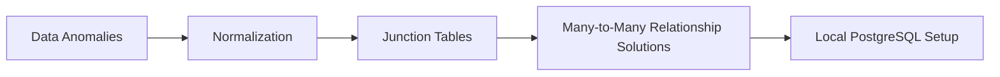

Each topic in this module builds upon the previous one. By understanding these concepts step by step, you will develop a strong foundation in database design and PostgreSQL, making it easier to work with real-world database applications.

## Data Anomalies and Types of Anomalies in DBMS

**Database anomalies** are inconsistencies or unexpected issues that occur when data is inserted, updated, or deleted in a poorly designed database structure. These problems typically arise when redundant data is stored in a single table.

### Update Anomaly

An **Update Anomaly** occurs when the same information is stored in multiple rows, and updating that information requires modifying several records. If one or more rows are missed during the update, the database becomes inconsistent.

#### Example

|e_id|name|branch|address|
|---|---|---|---|
|1|Arish|dhaka|rampura|
|2|Nuruddin|comilla|durgapur|
|3|Payel|dhaka|rampura|
|4|Hassan|barisal|banglabazar|
|6|Shifa|dhaka|rampura|

> In this table, the `dhaka` branch and its address `rampura` are repeated across multiple employee records.

If the Dhaka branch office moves from **Rampura** to **Mirpur**, every employee record associated with that branch must be updated. If one record is accidentally left unchanged, the database will contain conflicting information about the same branch. This creates an update anomaly because a single real-world change requires multiple database updates.

### Delete Anomaly

A **Delete Anomaly** occurs when deleting a record unintentionally removes other important information that should have been preserved.

#### Example

|e_id|name|branch|address|
|---|---|---|---|
|1|Arish|dhaka|rampura|
|2|Nuruddin|comilla|durgapur|
|3|Payel|dhaka|rampura|
|**4**|**Hassan**|**barisal**|**banglabazar**|
|6|Shifa|dhaka|rampura|

#### After Deletion

|e_id|name|branch|address|
|---|---|---|---|
|1|Arish|dhaka|rampura|
|2|Nuruddin|comilla|durgapur|
|3|Payel|dhaka|rampura|
|6|Shifa|dhaka|rampura|

> Deleting Hassan deletes all information about the Barisal branch.

Because the information about the `barisal` branch exists only in Hassan's record, deleting that employee also removes the branch's existence from the database. As a result, valuable branch information is lost even though the intention was only to remove an employee record.

### Insert Anomaly

An **Insert Anomaly** occurs when a database structure prevents valid data from being inserted independently or allows incomplete and inconsistent data to be stored.

#### Example

##### Original Data

|e_id|name|branch|address|
|---|---|---|---|
|1|Arish|dhaka|rampura|
|2|Nuruddin|comilla|durgapur|
|3|Payel|dhaka|rampura|
|4|Hassan|barisal|banglabazar|
|6|Shifa|dhaka|rampura|

##### After Insertion Attempts

|e_id|name|branch|address|
|---|---|---|---|
|1|Arish|dhaka|rampura|
|2|Nuruddin|comilla|durgapur|
|3|Payel|dhaka|rampura|
|4|Hassan|barisal|banglabazar|
|6|Shifa|dhaka|rampura|
|**7**|**John**|**dhaka**|**mirpur**|
|**8**|**Kofil**|||

#### Problems

##### Inconsistent Branch Information (`e_id: 7`)

John is assigned to the `dhaka` branch, but the address is entered as `mirpur` instead of the existing `rampura` address. Since branch information is duplicated across employee records, the database now contains conflicting information about the same branch.

##### Incomplete Data (`e_id: 8`)

Kofil is inserted without any branch or address information. This creates incomplete records and reduces data reliability.

> Proper validation should prevent invalid branch-address combinations and disallow critical fields from being left empty.

### Solution: Normalization

The root cause of these anomalies is that **employee information** and **branch information** are stored in the same table. This creates data redundancy and makes the database difficult to maintain.

A normalized design separates employees and branches into different tables and connects them using a relationship.

#### Employee Table

|e_id|name|b_id|
|---|---|---|
|1|Arish|1|
|2|Nuruddin|2|
|3|Payel|1|
|4|Hassan|3|
|6|Shifa|1|
|7|John|1|

#### Branch Table

|b_id|branch|address|
|---|---|---|
|1|dhaka|rampura|
|2|comilla|durgapur|
|3|barisal|banglabazar|

#### Relationship Diagram

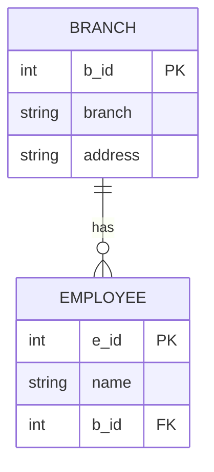

#### How Normalization Solves These Anomalies

- **Solves Update Anomaly:** Branch information exists in only one row inside the `BRANCH` table. If the Dhaka office address changes, only a single record needs to be updated.
- **Solves Delete Anomaly:** Deleting an employee does not delete branch information because branch data is stored separately.
- **Solves Insert Anomaly:** A new branch can be added even if no employees currently belong to it. Similarly, employees can only reference valid branch IDs, preventing inconsistent branch-address combinations.

#### Benefits of Normalization

- Eliminates data redundancy.
    
- Improves data consistency.
    
- Reduces storage waste.
    
- Simplifies updates and maintenance.
    
- Prevents update, delete, and insert anomalies.
    
- Creates a more scalable database design.

## Normalization and Functional Dependency

### Functional Dependency

A **functional dependency** describes a relationship between two attributes in a table where one attribute (or a set of attributes) uniquely determines another attribute.

In simple terms:

> If you know X, you can determine Y exactly.

We write it as:

```id="fd1"
X → Y
```

Meaning: **X determines Y**

---

### Basic Idea

- If one value of X always gives the same value of Y → Functional dependency exists
    
- If one value of X gives multiple values of Y → Functional dependency does NOT exist
    

---

### Example 1: No Functional Dependency

|x|y|
|---|---|
|1|0|
|2|3|
|3|5|
|4|7|
|2|5|

Here:

- x = 2 maps to y = 3 and y = 5
    

So:

- One X → multiple Y values ❌
    

Conclusion:

```id="fd2"
x → y does NOT exist
```

---

### Example 2: Functional Dependency Exists

|x|y|
|---|---|
|1|0|
|2|3|
|3|5|
|4|7|
|2|3|

Here:

- x = 2 always maps to y = 3
    

So:

```id="fd3"
x → y exists
```

Condition:

> Each value of X must map to exactly one value of Y

---

### Role Example (man = manager)

|Role|Name|
|---|---|
|manager|mezba|
|dev|mir|
|manager|milton|
|instructor|shafayt|
|dev|tanmoy|
|manager|toky|

### Analysis

- manager → mezba / milton / toky
    
- dev → mir / tanmoy
    

So:

```id="fd4"
Role → Name does NOT exist
```

Because:

- One role maps to multiple names
    
- So Role cannot uniquely determine Name
    

---

### Key Concept

A functional dependency requires:

- If X repeats, Y must always stay the same
    
- Any variation in Y for same X breaks the dependency
    

---

### ID Example (Valid Functional Dependency)

|id|name|dept|
|---|---|---|
|101|john|engineering|
|102|emily|marketing|
|103|sarah|engineering|
|104|jack|HR|
|105|john|manager|

### Analysis

Since `id` is unique:

```id="fd5"
id → name
id → dept
```

Both are valid functional dependencies.

---

### Important Insight

- Repeated values in non-key columns do not matter
    
- What matters is whether the determinant (left side) is unique and consistent
    

---

### Final Summary

- Functional dependency = one-to-one mapping from determinant side
    
- X → Y holds only if X always produces the same Y
    
- If multiple outputs exist for same X, dependency is invalid
    
- This concept is the base of normalization

## Normal forms

**Normal forms:** A set of rules applied to our db tables to reduce redundancy and avoid anomalies in data by organizing in properly

- 0NF
- 1NF
- 2NF
- 3NF

## 1NF | First Normal Form

### Rules of 1NF

- All values must be **atomic (indivisible)**
    
- Column names must be **unique**
    
- No repeating groups or positional dependency of data
    
- Each column must contain values of the **same data type**
    
- A **primary key** must be defined
    

---

### Given Table

|SI no.|Title|Courses|
|---|---|---|
|11|Xkon|CN, OS|
|12|Ykon|Java|
|13|4534|C, C++|

---

### 1NF Checklist Evaluation

#### Atomic Values

- ❌ Not satisfied
    
- `Courses` contains multiple values in a single cell (CN, OS / C, C++)
    

#### Unique Column Names

- ✔ Satisfied
    
- All column names are unique
    

#### No Positional Dependency

- ✔ Satisfied
    
- Table structure is properly organized
    

#### Same Data Type per Column

- ✔ Mostly satisfied
    
- But `Title` column has inconsistent type usage (string vs numeric-like value "4534")
    

#### Primary Key Exists

- ✔ Satisfied
    
- `SI no.` can act as a primary key
    

---

### Final Verdict

```id="1nf_v1"
NOT in 1NF
```

Reason:

- The `Courses` column violates atomicity (multiple values stored in one cell)
    

---

### Converted Table (1NF Form)

|SI no.|Title|Course|
|---|---|---|
|11|Xkon|CN|
|11|Xkon|OS|
|12|Ykon|Java|
|13|4534|C|
|13|4534|C++|

---

### Key Insight

- 1NF requires **one value per cell**
    
- Multi-valued attributes must be split into separate rows
    
- Each row must represent a single atomic fact

## 2NF | Second Normal Form

### Rules of 2NF

- The table must already be in **1NF**
    
- No **non-key attribute** should depend on only part of a candidate key (No Partial Dependency)
    

---

### Given Table

|Stud_id|c_id|c_name|Instructor|
|---|---|---|---|
|101|1|Math|Prof. Smith|
|102|2|Science|Prof. Johnson|
|101|3|History|Prof. Adams|
|103|1|Math|Prof. Smith|

---

### Identifying the Candidate Key

Neither `Stud_id` nor `c_id` alone can uniquely identify a row.

The combination of:

```id="2nf1"
(Stud_id, c_id)
```

uniquely identifies each record.

Therefore, the **composite candidate key** is:

|Candidate Key|
|---|
|(Stud_id, c_id)|

---

### 2NF Checklist Evaluation

#### Must Be in 1NF

- ✔ Satisfied
    
- Every cell contains atomic values.
    
- There are no repeating groups.
    

#### No Partial Dependency

- ❌ Not Satisfied
    

Let's analyze the dependencies:

```id="2nf2"
c_id → c_name
c_id → Instructor
```

For example:

|c_id|c_name|Instructor|
|---|---|---|
|1|Math|Prof. Smith|
|2|Science|Prof. Johnson|
|3|History|Prof. Adams|

Notice that:

- Knowing only `c_id` is enough to determine `c_name`
    
- Knowing only `c_id` is enough to determine `Instructor`
    

However, the primary key is `(Stud_id, c_id)`.

This means `c_name` and `Instructor` depend on only **part of the composite key**, not the entire key.

This is called a **Partial Dependency**, which violates 2NF.

---

### Why This Is a Problem

Course information is repeated for every student enrolled in that course.

For example:

|Stud_id|c_id|c_name|Instructor|
|---|---|---|---|
|101|1|Math|Prof. Smith|
|103|1|Math|Prof. Smith|

If the instructor for Math changes, every row containing `c_id = 1` must be updated.

This introduces redundancy and can lead to update anomalies.

---

### Final Verdict

```id="2nf3"
The table is NOT in 2NF
```

Reason:

- `c_name` depends only on `c_id`
    
- `Instructor` depends only on `c_id`
    
- Both are partial dependencies on the composite key `(Stud_id, c_id)`
    

---

### Converted Table (2NF Form)

### Student_Course Table

|Stud_id|c_id|
|---|---|
|101|1|
|102|2|
|101|3|
|103|1|

### Course Table

|c_id|c_name|Instructor|
|---|---|---|
|1|Math|Prof. Smith|
|2|Science|Prof. Johnson|
|3|History|Prof. Adams|

---

### Relationship Diagram

```mermaid
erDiagram
    COURSE ||--o{ STUDENT_COURSE : contains

    COURSE {
        int c_id PK
        string c_name
        string instructor
    }

    STUDENT_COURSE {
        int stud_id
        int c_id FK
    }
```

---

### How 2NF Solves the Problem

- Course information is stored only once.
    
- Instructor changes require updating a single row.
    
- Data redundancy is reduced.
    
- Partial dependencies are eliminated.
    
- The database becomes easier to maintain and less prone to anomalies.
    

---

### Key Insight

A table violates **2NF** when a non-key attribute depends on only part of a composite key.

The solution is to move those partially dependent attributes into a separate table and connect them using a key relationship.

## 3NF | Third Normal Form

### Given Table

|stud_id|stud_name|stud_phone|state|country|stud_age|
|---|---|---|---|---|---|
|101|John|12345679|California|USA|20|
|102|Emily|87654332|Toronto|Canada|21|
|103|Alex|14674535|California|USA|22|

---

## Rules of 3NF

- Must already be in **2NF**
    
- Must not contain **transitive dependency**
    

---

## Transitive Dependency

> [!NOTE] Transitive Dependency  
> A transitive dependency happens when:
> 
> If **X → Y** and **Y → Z**, then **X → Z**
> 
> Example:
> 
> - stud_id → state
>     
> - state → country
>     
> - therefore stud_id → country (transitively)
>     

---

### Transitive Dependency in This Table

We know:

- `stud_id → stud_name, stud_phone, state, stud_age`
    
- `state → country`
    

So:

```id="3nf1"
stud_id → state
state → country
⇒ stud_id → country (transitive dependency)
```

---

## Why This Creates a Problem

Because `country` depends on `state`, not directly on `stud_id`, we store derived information inside the same table.

This causes:

- Repetition of country values across multiple rows
    
- If a state's country changes, multiple rows must be updated
    
- Risk of inconsistent data if some rows are missed
    
- Data is indirectly dependent, which violates clean schema design
    

---

## 3NF Violation Check

> [!NOTE] Recap Check
>- Table is in **2NF** ✔ 
>- Contains **transitive dependency** ❌ (`state → country`)
    
### Final Verdict

```id="3nf2"
NOT in 3NF
```

---

## Decomposition (3NF Solution)

We split the table to remove transitive dependency.

---

### Student Table

|stud_id|stud_name|stud_phone|state|stud_age|
|---|---|---|---|---|
|101|John|12345679|California|20|
|102|Emily|87654332|Toronto|21|
|103|Alex|14674535|California|22|

---

### State Table

|state|country|
|---|---|
|California|USA|
|Toronto|Canada|

---

## Relationship Model

```mermaid
erDiagram
    STATE ||--o{ STUDENT : has

    STATE {
        string state PK
        string country
    }

    STUDENT {
        int stud_id PK
        string stud_name
        string stud_phone
        string state FK
        int stud_age
    }
```

---

## How 3NF Solves the Problem

- Removes transitive dependency (`state → country`)
    
- Eliminates redundant storage of country data
    
- Ensures a single source of truth for state → country mapping
    
- Prevents update anomalies
    
- Improves consistency and schema clarity
    

---

## Recap

> [!NOTE] Steps of DB Design
>
>- Determining entities (done)
   > 
>- Determining attributes of each entity (done)
   > 
>- Relationships among entities (done)
   > 
>- Resolving many-to-many relationships
  >  
>- Normalization (1NF → 2NF → 3NF)


## Resolving Many-to-Many Relationships

### ER Diagram (Initial Concept)

```mermaid
erDiagram
    Student }|--|{ Courses : enrolls

    Student {
        int id PK
        string name
        string email
    }

    Courses {
        int c_id PK
        string name
        int i_id FK
    }
```

---

### Why Many-to-Many is a Problem

A many-to-many relationship exists when:

- One student can enroll in multiple courses
    
- One course can have multiple students
    

#### Issues

- Data redundancy
    
- Update anomalies
    
- Insert restrictions
    
- Delete anomalies
    
- Breaks normalization rules
    

---

### Problematic Designs

### Variation 1: Multi-Value Fields

#### Student Table

|s_id|name|c_ids|
|---|---|---|
|101|John|1, 2|
|102|Emily|2|
|103|Sarah|1, 3|

#### Course Table

|c_id|c_name|s_ids|
|---|---|---|
|1|Math|101, 103|
|2|Science|101, 102|
|3|History|103|

#### Flaws

- Not atomic values (violates 1NF)
    
- Hard to query and filter
    
- No proper relational structure
    
- Update anomalies
    

---

### Variation 2: Row Explosion

#### First Table

|id|name|c_id|
|---|---|---|
|101|John|1|
|101|John|2|
|102|Emily|2|
|103|Sarah|1|
|103|Sarah|3|

#### Flaws

- Repeated student data
    
- Update anomaly risk
    
- Redundant storage
    

---

#### Second Table

|c_id|name|s_id|
|---|---|---|
|1|Math|101|
|1|Math|103|
|2|Science|101|
|2|Science|102|
|3|History|103|

#### Flaws

- Course data repeated
    
- Redundant storage
    
- Inconsistent update risk
    

---

### Variation 3: Fixed Column Design

#### First Table

|id|name|c_id1|c_id2|c_id3|
|---|---|---|---|---|
|101|John|1|2||
|102|Emily||2||
|103|Sarah|1||3|

#### Flaws

- Not scalable
    
- Violates 1NF (non-atomic values)
    
- NULL-heavy structure
    
- Poor flexibility
    

---

### Solution: Junction (Bridge) Table

#### Definition

A junction table is a linking table used to convert a many-to-many relationship into two one-to-many relationships.

---

### Final Normalized Design

#### Student Table

|id|name|
|---|---|
|101|John|
|102|Emily|
|103|Sarah|

---

#### Course Table

|c_id|name|
|---|---|
|1|Math|
|2|Science|
|3|History|

---

#### Junction Table (Enrollment)

|s_id|c_id|
|---|---|
|101|1|
|101|2|
|102|2|
|103|1|
|103|3|

---

### ER Diagram (Final Design)

```mermaid
erDiagram
    student ||--|{ enrollment : has
    course ||--|{ enrollment : contains

    student {
        int student_id PK
        string name
        string email
    }

    enrollment {
        int student_id FK
        int course_id FK
    }

    course {
        int course_id PK
        string course_name
        int credits
    }
```

---

### Why Junction Table Works

- Converts many-to-many into two one-to-many relationships
    
- Eliminates redundancy
    
- Maintains relational integrity
    
- Improves scalability
    
- Fully supports normalization principles
    

---

### Key Insight

Many-to-many relationships cannot exist directly in relational databases.

They must always be decomposed into:

- Two one-to-many relationships
    
- Connected via a junction (bridge) table

## Updated ERD in draw.io


## What’s PostgreSQL

PostgreSQL is an open-source relational database management system (RDBMS) known for its reliability, extensibility, and advanced features.

---

### Why PostgreSQL

- Open source
    
- Highly scalable
    
- Modern feature set
    
- Supports advanced data types
    
- ACID compliance
    
- Powerful indexing system
    

---

### ACID Compliance

ACID is a set of properties that guarantees reliable database transactions:

- **Atomicity**: A transaction is fully completed or not executed at all
    
- **Consistency**: Database moves from one valid state to another
    
- **Isolation**: Concurrent transactions do not interfere with each other
    
- **Durability**: Once a transaction is committed, it remains permanent even after system failure
    

---

### Indexing

Indexing is a database optimization technique used to speed up data retrieval operations.

Instead of scanning every row in a table, the database uses an index (similar to a book index) to directly locate the required data.

#### Key Idea:

- Faster reads (SELECT queries)
    
- Extra storage required
    
- Slightly slower writes (INSERT/UPDATE/DELETE) due to index maintenance
    

---

## Download PostgreSQL

[https://www.postgresql.org/download/](https://www.postgresql.org/download/)

### PostgreSQL Installation and Setup Guide

I use Linux Mint 22.3 , the installation follows the Debian-based PostgreSQL repository method.

---

### System Prerequisites

Run these commands in the terminal to prepare the system and add the official PostgreSQL repository:

```bash
sudo apt update
sudo apt install gnupg2 wget -y
```

Add PostgreSQL GPG key:

```bash
curl -fsSL https://www.postgresql.org/media/keys/ACCC4CF8.asc | sudo gpg --dearmor -o /etc/apt/trusted.gpg.d/postgresql.gpg
```

Add PostgreSQL repository:

```bash
sudo sh -c 'echo "deb http://apt.postgresql.org/pub/repos/apt $(lsb_release -cs)-pgdg main" > /etc/apt/sources.list.d/pgdg.list'
```

Update package list:

```bash
sudo apt update
```

---

### Database Engine Installation

Install PostgreSQL server and additional utilities:

```bash
sudo apt install postgresql-16 postgresql-contrib -y
```

---

### Service Verification

Check if PostgreSQL service is running:

```bash
systemctl status postgresql
```

Check database clusters:

```bash
pg_lsclusters
```

---

### Superuser Authentication Setup

Switch to PostgreSQL default user:

```bash
sudo -u postgres psql
```

Set password for postgres user:

```sql
ALTER USER postgres PASSWORD 'your_secure_password';
```

Exit:

```sql
\q
```

---

### Developer Environment Setup

Create a dedicated database user and database mapped to your system username.

Replace `YOUR_USERNAME` and `YOUR_PASSWORD` with your actual Linux login credentials.

```bash
sudo -u postgres psql
```

Create user and database:

```sql
CREATE USER YOUR_USERNAME WITH PASSWORD 'YOUR_PASSWORD' CREATEDB;
CREATE DATABASE YOUR_USERNAME OWNER YOUR_USERNAME;
```

Exit:

```sql
\q
```

---

### Standard Connection Protocol

Access PostgreSQL as a normal user:

```bash
psql
```

Exit:

```bash
\q
```

---

### Key Insight

- System user-based database setup removes the need for repeated `sudo`
    
- Separate database roles improve security and isolation
    
- PostgreSQL runs as a background service managed by `systemctl`

## PostgreSQL Terminal Commands & Database Structure

### Database Management Commands

- **List Databases:** Use `\l` to display a list of all databases in PostgreSQL.
    
- **Default Databases:**
    
    - `postgres`: The primary database created automatically during installation to facilitate early setup and testing.
        
    - `template0`: The base template containing default configuration settings, built-in functions, and fundamental structural features.
        
    - `template1`: A replica database serving as a fallback system blueprint used to mirror structural architecture whenever new databases are spawned.
        
- **Clear Terminal View:** Type `\! cls` to refresh and clean the console window workspace.
    

### Session and Metadata Queries

- **Connection Metadata:** Use `\conninfo` to view runtime session credentials, including current user identities, active server address bindings, and network communication ports.
    
- **Database Table Inspection:** Execute `\dt` to scan for user-defined relational tables.
    
- **Database System Metadata:**
    
    - Retrieve engine installation versions with:
        

SELECT version();

*   Query the system clock's calendar status via:
```sql
SELECT current_date;
```

*   List current system users or defined roles using `\du`.
### Schema Customization and Data Verification

- **Table Production Syntax Example:**
    
    SQL
    
    ```
    CREATE TABLE users (
        id SERIAL PRIMARY KEY, 
        name VARCHAR(50)
    );
    ```
    


*   **Relational Scans:** Run an standard query block to evaluate structural attributes and row presence in a specific table:
    ```sql
    SELECT * FROM users;
    ```


Here is a list of the most commonly used PostgreSQL CLI (`psql`) commands on Linux Mint, categorized for easy reading.
### Connecting & Getting Help

1. `psql -U username -d database_name` - This is used from the Linux terminal to log into a specific PostgreSQL database as a specific user.
    
2. `\c database_name` - This is used inside the prompt to switch (connect) to a different database.
    
3. `\conninfo` - This is used to display information about the current database connection (current user, host, database, and port).
    
4. `\?` - This is used to show a help menu listing all available internal `psql` backslash commands.
    
5. `\h command_name` - This is used to display help and the syntax format for a specific SQL command (e.g., `\h CREATE TABLE`).
    

### Listing & Exploring Objects

6. `\l` - This is used to list all existing databases on the PostgreSQL server, along with their owners and encoding types.
    
7. `\dt` - This is used to list all tables in the current database.
    
8. `\d table_name` - This is used to describe a table's structure, showing its columns, data types, modifiers, and indexes.
    
9. `\d+ table_name` - This is used to show a more detailed description of a table, including column descriptions and its physical size on the disk.
    
10. `\dn` - This is used to list all the schemas in the current database.
    
11. `\dv` - This is used to list all views in the database.
    
12. `\df` - This is used to list all functions/stored procedures.
    
13. `\du` - This is used to list all database users (roles) and their specific privileges/attributes.
    

### System, Buffers & Formatting

14. `\x` - This is used to toggle "expanded display" mode on or off. It flips rows into vertical lists, which makes wide tables much easier to read on a terminal.
    
15. `\timing` - This is used to toggle the execution timer. When on, it prints exactly how many milliseconds every subsequent SQL query takes to run.
    
16. `\r` - This is used to reset (clear) the current query buffer if you made a typo and want to start writing your SQL query fresh.
    
17. `\e` - This is used to open the current query buffer in Linux Mint's default text editor (like Nano or Vim). Saving and exiting the editor will automatically execute the query.
    
18. `\! bash_command` - This is used to execute a Linux shell command without exiting the `psql` interface (e.g., `\! ls` or `\! clear`).
    

### Input, Output & Exiting

19. `\i file_path.sql` - This is used to execute SQL commands from an external `.sql` script file on your system.
    
20. `\copy table_name TO '/path/to/file.csv' WITH CSV HEADER` - This is used to export data from a database table directly into a CSV file on your local machine.
    
21. `\q` - This is used to safely exit and quit the `psql` interactive terminal.

# Module 13: PostgreSQL database management and Data types using pgAdmin

This module focuses on learning **Raw SQL directly on our local computer**.

The reason is simple: before using any framework, having strong fundamentals is very important. So in this module, we will study SQL in its raw form without any abstraction.

Slide Link: [https://drive.google.com/file/d/1zPLUb2mSC4w2cT7YIV8jGYi5RWK__-q-/view?usp=drive_link](https://drive.google.com/file/d/1zPLUb2mSC4w2cT7YIV8jGYi5RWK__-q-/view?usp=drive_link)

## Intro to SQL

The language used to communicate with databases is called **Structured Query Language (SQL)**.

It was born in the **1970s at IBM** and later became an official standard in **1986**. Today, it is supported by almost every modern database system.

### Key Property: Declarative Language

SQL is a **declarative language**, meaning:

- You specify _what you want_
    
- Not _how to get it_
    

Example:

```sql
SELECT name FROM students WHERE age > 18;
```

### SQL Statement Categories

```mermaid
flowchart TD
    A[SQL Statement] --> B[DDL]
    A --> C[DML]
    A --> D[DQL]
    A --> E[DCL]
    A --> F[TCL]

    B --> B1[CREATE]
    B --> B2[DROP]
    B --> B3[ALTER]
    B --> B4[TRUNCATE]

    C --> C1[INSERT]
    C --> C2[UPDATE]
    C --> C3[DELETE]

    D --> D1[SELECT]

    E --> E1[GRANT]
    E --> E2[REVOKE]

    F --> F1[COMMIT]
    F --> F2[ROLLBACK]
```

### Types of SQL Statements

#### Data Definition Language (DDL)

Used to define or modify database structure.

- CREATE
    
- DROP
    
- ALTER
    
- TRUNCATE
    

#### Data Manipulation Language (DML)

Used to manipulate data inside tables.

- INSERT
    
- UPDATE
    
- DELETE
    

#### Data Query Language (DQL)

Used to retrieve data.

- SELECT
    

#### Data Control Language (DCL)

Used for permissions and access control.

- GRANT
    
- REVOKE
    

#### Transaction Control Language (TCL)

Used to manage database transactions.

- COMMIT
    
- ROLLBACK
    

### Summary

SQL is a declarative language used to interact with databases. It is old but still foundational, powering all modern data systems and continues to play a key role in future data-driven and AI systems.

## PgAdmin Basics

PgAdmin is a **graphical user interface (GUI) tool** for managing PostgreSQL databases.  
It lets you run SQL queries, browse tables, and manage databases visually instead of using only the terminal.

Install pgAdmin from the official pgAdmin website. Follow the installer, complete setup, then connect it to your PostgreSQL instance using the same credentials used in `psql` (host, port, username, password, database).

> If you cannot even figure out how to install pgAdmin from the official source, that’s not a database issue. That’s a basic ability to read documentation and follow setup instructions problem - which is non-negotiable for anyone trying to become a developer.

---

### PostgreSQL Table Creation (CLI)

PostgreSQL is a relational database where data is stored in tables inside a database. In `psql`, you first create a database:

```sql
CREATE DATABASE school;
```

Then connect to it:

```sql
\c school
```

Now create a table using SQL:

```sql
CREATE TABLE users (
    id SERIAL PRIMARY KEY,
    name VARCHAR(100) NOT NULL,
    email VARCHAR(150) UNIQUE NOT NULL,
    password TEXT NOT NULL,
    age INT,
    created_at TIMESTAMP DEFAULT NOW()
);
```

This defines columns with data types and constraints like `PRIMARY KEY` and `UNIQUE`.

To verify tables:

```sql
\dt
```

To see table structure:

```sql
\d users
```

If pgAdmin does not show the table:

- Refresh the schema
    
- Ensure you are connected to the correct `school` database
    
- Check the `public` schema


The table is now created and visible in pgAdmin under the database schema.

---

### Recreating Table via pgAdmin Query Tool

Now drop the table:

```sql
DROP TABLE users;
```

Then recreate it using pgAdmin Query Tool instead of CLI:

```sql
CREATE TABLE users (
    id SERIAL PRIMARY KEY,
    name VARCHAR(100) NOT NULL,
    email VARCHAR(150) UNIQUE NOT NULL,
    password TEXT NOT NULL,
    age INT,
    created_at TIMESTAMP DEFAULT NOW()
);
```

---


## Beekeeper Studio

Beekeeper Studio is a modern **database client** that lets you connect to databases, browse tables, and run SQL queries through a clean interface.

We could use pgAdmin, and it is a good tool. In fact, it is one of the most popular PostgreSQL administration tools available. However, for learning SQL, pgAdmin often feels heavy and cluttered because it includes many database administration features that we do not need right now.

Beekeeper Studio is lighter, cleaner, and more focused on the part we care about at this stage: **writing and running SQL queries**.

**Download:** [https://www.beekeeperstudio.io/](https://www.beekeeperstudio.io/)

Connect to your database.


We can see the `students` table here.

Let's write a query.


## PostgreSQL Data Types

Data types define what kind of data can be stored in a column. Choosing the correct data type improves:

- Data accuracy
    
- Performance
    
- Memory efficiency
    
- Clarity and constraints
    

### Main Categories

- Boolean
    
- Numbers
    
- Binary
    
- Date / Time
    
- JSON
    
- Character
    
- UUID
    
- Array
    
- XML
    

### Example Table

|id (SERIAL)|employee_id (INTEGER)|name (VARCHAR(50))|dob (DATE)|is_active (BOOLEAN)|
|---|---|---|---|---|
|1|4560|John|1990-05-15|true|
|2|8962|Doe|1985-08-22|false|

---

### Boolean

Stores logical values:

- `true`
    
- `false`
    
- `null`
    

---

### Numbers / Integer

|Data Type|Storage|Range / Precision|Use Case|
|---|---|---|---|
|SMALLINT (`int2`)|2 bytes|-32,768 to +32,767|Small numbers (age, quantity)|
|INTEGER (`int4`)|4 bytes|~ -2B to +2B|Default choice for whole numbers|
|BIGINT (`int8`)|8 bytes|~ -9 quintillion to +9 quintillion|Very large numbers (IDs, counters)|
|REAL (`float4`)|4 bytes|~6 decimal digits precision|Approximate values (sensor data)|
|DOUBLE PRECISION (`float8`)|8 bytes|~15 decimal digits precision|Higher precision calculations|
|NUMERIC / DECIMAL|Variable|User-defined exact precision|Financial and monetary calculations|
|SERIAL|4 bytes|1 to 2,147,483,647|Auto-incrementing IDs and primary keys|

---

### Character

|Data Type|Storage|Length|Use Case|
|---|---|---|---|
|CHAR(n)|n bytes|Fixed length|When the exact length is known (e.g., country codes like `USA`)|
|VARCHAR(n)|Variable|Up to n characters|Flexible length with a maximum limit (e.g., usernames, emails)|
|TEXT|Variable|Unlimited|Long text, descriptions, comments|

---

### Date / Time

|Data Type|Example|Notes|
|---|---|---|
|DATE|`'1980-12-20'`|Stores only the date|
|TIME|`'14:30:00'`|Stores only the time|
|TIMETZ|`'14:30:00+06'`|Time with timezone|
|TIMESTAMP|`'2025-08-29 14:30:00'`|Date and time|
|TIMESTAMPTZ|`'2025-08-29 14:30:00+06'`|Date and time with timezone|
|INTERVAL|`'3 days 4 hours'`|Represents a duration or time difference|
### UUID

UUID stands for **Universally Unique Identifier**.

It is used to generate globally unique values, making it useful for distributed systems where uniqueness must be guaranteed across multiple databases or services.

Example:

```sql
'550e8400-e29b-41d4-a716-446655440000'
```

Common use cases:

- User IDs
    
- Order IDs
    
- API resource identifiers
    
- Distributed systems where auto-increment IDs may cause conflicts

## Writing some queries

### 1. Create and drop DB / Tables

```sql
-- drop database
drop database school

-- create database
create database school
```

**Creating table**

```sql
CREATE TABLE table_name
(
    column1 datatype constraint,
    column2 datatype constraint,
    column3 datatype constraint,
    ....
);
```

```sql
-- didn't add constraints yet
create table students (
  id serial,
  name varchar(50),
  age integer,
  isActive boolean,
  dob date
)
```


### 2. Column constraints

Constraints are rules applied to table columns to control the type and validity of data stored in them.

---

**NOT NULL**

Ensures a column cannot have NULL values.

```sql
CREATE TABLE example (
    name VARCHAR(50) NOT NULL
);
```

---

**UNIQUE**

Ensures all values in a column are different.

```sql
CREATE TABLE example_unique (
    email VARCHAR(100) UNIQUE,
    name VARCHAR(50) NOT NULL
);
```

---

**Primary Key**

A Primary Key is:

- UNIQUE
    
- NOT NULL
    

```sql
CREATE TABLE students (
    student_id SERIAL PRIMARY KEY,
    name VARCHAR(50) NOT NULL
);
```

---

**Foreign Key**

Used to create relationships between tables.

```sql
CREATE TABLE orders (
    order_id SERIAL PRIMARY KEY,
    product_id INTEGER REFERENCES product(product_id)
);
```

 **Relationship Visualization**

```mermaid
erDiagram
    PRODUCT ||--o{ ORDER : has

    PRODUCT {
        int product_id
        string product_title
    }

    ORDER {
        int order_id
        int prod_id
    }
```

This shows:

- One **Product** can have multiple **Orders**
    
- Each **Order** belongs to one **Product**
---

**DEFAULT**

Assigns a default value if none is provided.

```sql
CREATE TABLE users (
    user_id SERIAL PRIMARY KEY,
    name VARCHAR(50),
    status VARCHAR(20) DEFAULT 'active'
);
```

---

**CHECK**

Adds a condition to validate data.

```sql
CREATE TABLE employees (
    emp_id SERIAL PRIMARY KEY,
    name VARCHAR(50),
    age INT CHECK (age >= 18)
);
```

---

**Comprehensive Table Examples**

```sql
CREATE TABLE students (
    student_id SERIAL PRIMARY KEY,
    full_name VARCHAR(100) NOT NULL,
    email VARCHAR(100) UNIQUE,
    age INT CHECK (age >= 18),
    status VARCHAR(20) DEFAULT 'active'
);
```

```sql
create table students (
    id serial primary key,
    username varchar(50) not null,
    email varchar(100),
    age smallint check (age >= 18),
    isActive boolean default true,
    unique(username, email) -- constraints can be written like this too
);
```

### 3. Data Insertion 

---

**_Single-Row Insert_**

```sql
INSERT INTO students (id, name, age)
VALUES (1, 'Arish', 5);
```

---

**_Multi-Row Insert_**

```sql
INSERT INTO students (id, name, age)
VALUES
(2, 'Mizan', 29),
(3, 'Rahman', 28),
(4, 'Hasan', 30);
```

---

**_Insert Without Column List_**

Table Structure:

```sql
CREATE TABLE students (
    id SERIAL PRIMARY KEY,
    name VARCHAR(50),
    age INT
);
```

---

**_Correct Execution (Explicit ID Provided)_**

```sql
INSERT INTO students
VALUES (1, 'Sadia', 22);
```

---

**_Incorrect Execution (Missing Column List)_**

```sql
INSERT INTO students
VALUES ('Sadia', 22);
-- ❌ error
```

Reason:

- `id` is `SERIAL`, expects proper handling
    
- Column list missing, so mapping fails
    

---

**_Correct Execution (Best Practice)_**

```sql
INSERT INTO students (name, age)
VALUES ('Sadia', 22);
```

This lets PostgreSQL auto-generate the `id` safely.

# Module 14: PostgreSQL advanced data manipulation technique

Here, we will dive deeper into PostgreSQL, where we will learn advanced data manipulation techniques and work with more powerful database operations.

Slide Link: [https://drive.google.com/file/d/1s5VPi8b89d1zs8JvzWS_juDyB4-8kJF2/view](https://drive.google.com/file/d/1s5VPi8b89d1zs8JvzWS_juDyB4-8kJF2/view)

## Alter table and constraints

%% why is it used ? %%
%% modding existing db %%

**Basic format**

```sql
ALTER TABLE table_name action;
-- action: rename, add/drop, modify data type etc
```

### **Created a table for exercise**

```sql
create table employe (
  id serial,
  name varchar(100),
  age int
)
```

1. **Rename**

```sql
alter table employe
  rename to employee
```

2. **Add column**

```sql
alter table employee
  add column 
        email varchar(50) 
```

3. **Drop a column**

```sql
alter table employee
  drop column email 
```

4. **Rename column**

```sql
alter table employee
  drop column email 
```

5. **Modify constraints**

```sql
alter table employee
  alter column username type varchar(50)
```

6. **Add constraints**

```sql
alter table employee
  alter column email set not null
```

7. **Remove constraints**

```sql
alter table employee
  alter column email drop not null
```

8. **Set default value**
```sql
alter table employee
  alter column email set default 'test@gmail.com'
```

9. **Add table level constraints**

```sql
alter table employee
  add constraint unique_employee unique(email, username)
```

(email, username)  
must be unique together

not individually unique

## SELECT Basics, Sorting, and Aliases

The `SELECT` statement is used to retrieve data from one or more tables. It can be customized using filtering, sorting, grouping, joins, and other clauses.

**Common SELECT Clauses (Most Used → Least Used)**

|Clause|Purpose|
|---|---|
|`SELECT`|Specifies which columns to retrieve|
|`FROM`|Specifies the source table(s)|
|`WHERE`|Filters rows based on conditions|
|`ORDER BY`|Sorts the result set|
|`LIMIT`|Restricts the number of returned rows|
|`DISTINCT`|Removes duplicate values|
|`JOIN`|Combines data from multiple tables|
|`GROUP BY`|Groups rows for aggregation|
|`HAVING`|Filters grouped data|
|`OFFSET`|Skips a specified number of rows|

---

**Created a table and inserted dummy data for implementation**

```sql
CREATE TABLE students (
  student_id SERIAL PRIMARY KEY,
  first_name VARCHAR(50) NOT NULL,
  last_name VARCHAR(50) NOT NULL,
  age INT,
  grade CHAR(2),
  course VARCHAR(50),
  email VARCHAR(100) UNIQUE,
  dob DATE,
  blood_type VARCHAR(5),
  country VARCHAR(50)
);
```


---

### Selecting All Columns

Retrieves every column from the table.

```sql
SELECT * FROM students;
```

---

### Selecting Specific Columns

Retrieves only the requested columns.

```sql
SELECT student_id, first_name, age
FROM students;
```

---

### Column Alias

Renames a column in the query result without changing the actual table structure.

```sql
SELECT first_name AS "First name"
FROM students;
```

```sql
SELECT
  first_name AS "First name",
  age AS "User age"
FROM students;
```

---

### Sorting Data

Sorts rows by age in descending order.

```sql
SELECT first_name, blood_type, age
FROM students
ORDER BY age DESC;
```

`ASC` = Ascending (default)  
`DESC` = Descending

## Distinct and Where Filtering

`DISTINCT` is used to remove duplicate values from the result set, while `WHERE` is used to filter rows based on specific conditions.

---

**_DISTINCT_**

Returns only unique values from a column.

```sql
SELECT DISTINCT course
FROM students;
```

**Output**

|course|
|---|
|Computer Science|
|Data Science|
|Mathematics|
|Physics|
|Software Engineering|
|Chemistry|
|Biology|

---

**_WHERE Filtering_**

Filters rows that match the specified condition.

```sql
SELECT first_name, age, course, grade
FROM students
WHERE course = 'Physics'
  AND grade = 'B+';
```

**Output**

|first_name|age|course|grade|
|---|---|---|---|
|Henry|21|Physics|B+|

The query returns only students who satisfy **both** conditions:

- `course = 'Physics'`
    
- `grade = 'B+'`

```sql
select first_name,age,course,grade from students 
  where course = 'Physics' AND (grade = 'B+' or grade = 'B')
```

**Output**

| Oliver | 18  | Physics	"B " |
| ------ | --- | ------------ |
| James  | 19  | Physics	B+   |
| Henry  | 21  | Physics	B+   |

## Comparison, BETWEEN, and IN

These operators are used to filter data based on conditions, ranges, or a list of possible values.

---

**_Comparison Operators_**

Comparison operators such as `=`, `!=`, `>`, `<`, `>=`, and `<=` are used to compare values.

```sql
SELECT *
FROM students
WHERE country != 'Australia'
  AND age >= 20;
```

**Output**

|student_id|first_name|country|age|
|---|---|---|---|
|1|Liam|USA|20|
|3|Noah|UK|21|
|6|Ava|Spain|20|
|8|Charlotte|USA|21|
|9|William|Mexico|23|
|10|Sophia|Colombia|20|
|12|Amelia|Argentina|22|
|13|Benjamin|Chile|21|
|15|Lucas|Canada|20|
|17|Henry|UK|21|
|18|Evelyn|Ireland|22|
|19|Alexander|USA|20|

---

**_BETWEEN_**

`BETWEEN` is used to filter values within a range (inclusive).

```sql
SELECT *
FROM students
WHERE age BETWEEN 20 AND 22;
```

**Output**

|first_name|age|
|---|---|
|Liam|20|
|Noah|21|
|Emma|22|
|Ava|20|
|Charlotte|21|
|Sophia|20|
|Amelia|22|
|Benjamin|21|
|Lucas|20|
|Henry|21|
|Evelyn|22|
|Alexander|20|

---

**_IN_**

`IN` is used when a column can match any value from a given list.

```sql
SELECT *
FROM students
WHERE country IN ('Ireland', 'USA', 'Canada');
```

**Output**

|first_name|country|
|---|---|
|Liam|USA|
|Charlotte|USA|
|James|USA|
|Lucas|Canada|
|Alexander|USA|
|Evelyn|Ireland|

Instead of writing:

```sql
WHERE country = 'Ireland'
   OR country = 'USA'
   OR country = 'Canada'
```

you can write:

```sql
WHERE country IN ('Ireland', 'USA', 'Canada')
```

which is shorter and easier to read.

## LIKE vs ILIKE

`LIKE` and `ILIKE` are used for pattern matching in text data.

- `LIKE` → Case-sensitive pattern matching
    
- `ILIKE` → Case-insensitive pattern matching (PostgreSQL-specific)
    

---

**_LIKE (Case-Sensitive)_**

Finds names that start with the letter `A`.

```sql
SELECT *
FROM students
WHERE first_name LIKE 'A%';
```

**Pattern Breakdown**

- `A` → Must start with `A`
    
- `%` → Any number of characters (including zero)
    

**Output**

| first_name |
| ---------- |
| Ava        |
| Amelia     |
| Alexander  |

---

**_LIKE with Underscores_**

Finds names that start with `A` and contain exactly 3 characters.

```sql
SELECT *
FROM students
WHERE first_name LIKE 'A__';
```

**Pattern Breakdown**

- `A` → Must start with `A`
    
- `_` → Exactly one character
    
- `_` → Exactly one character
    

Pattern length = 3 characters

**Output**

| first_name |
| ---------- |
| Ava        |

---

**_ILIKE (Case-Insensitive)_**

Finds names ending with `N` or `n`.

```sql
SELECT *
FROM students
WHERE first_name ILIKE '%N';
```

**Pattern Breakdown**

- `%` → Any number of characters before the ending
    
- `N` → Must end with `N` or `n`
    

**Output**

|first_name|
|---|
|Benjamin|
|Evelyn|

Because `ILIKE` ignores letter casing, it matches both uppercase and lowercase characters.
## NOT and Scalar Functions

`NOT` is used to negate a condition, while scalar functions operate on individual values and return a single result for each row.

---

**_NOT_**

Returns rows that do **not** satisfy the specified condition.

```sql
SELECT first_name, age, country
FROM students
WHERE NOT country = 'USA';
```

**Output**

All students except those whose country is `USA`.

Equivalent query:

```sql
SELECT first_name, age, country
FROM students
WHERE country != 'USA';
```

---

**_Scalar Functions_**

Scalar functions process a single value and return a single value.

Common scalar functions:

|Function|Purpose|
|---|---|
|`UPPER()`|Converts text to uppercase|
|`LOWER()`|Converts text to lowercase|
|`CONCAT()`|Combines multiple strings|
|`LENGTH()`|Returns the length of a string|

---

**_UPPER()_**

Converts text to uppercase.

```sql
SELECT UPPER(first_name)
FROM students;
```

**Output**

|upper|
|---|
|LIAM|
|OLIVIA|
|NOAH|
|EMMA|
|...|

---

**_LOWER()_**

Converts text to lowercase.

```sql
SELECT LOWER(first_name)
FROM students;
```

---

**_CONCAT()_**

Combines multiple strings into a single string.

```sql
SELECT CONCAT(first_name, last_name) AS "Full name"
FROM students;
```

**Output**

|Full name|
|---|
|LiamSmith|
|OliviaJohnson|
|NoahWilliams|
|EmmaBrown|
|...|

A more readable version:

```sql
SELECT CONCAT(first_name, ' ', last_name) AS "Full name"
FROM students;
```

**Output**

|Full name|
|---|
|Liam Smith|
|Olivia Johnson|
|Noah Williams|
|Emma Brown|
|...|

---

**_LENGTH()_**

Returns the number of characters in a string.

```sql
SELECT first_name, LENGTH(first_name)
FROM students;
```

**Output**

|first_name|length|
|---|---|
|Liam|4|
|Olivia|6|
|Noah|4|
|Emma|4|
|...|...|

### Aggregate Functions

Aggregate functions perform calculations on multiple rows and return a single result.

Common aggregate functions:

|Function|Purpose|
|---|---|
|`COUNT()`|Counts rows or non-null values|
|`SUM()`|Calculates the total of numeric values|
|`AVG()`|Calculates the average value|
|`MAX()`|Returns the highest value|
|`MIN()`|Returns the lowest value|

---

**_COUNT()_**

Counts the number of unique countries in the table.

```sql
SELECT COUNT(DISTINCT country)
FROM students;
```

**Output**

|count|
|---|
|12|

Here:

- `DISTINCT country` removes duplicate countries
    
- `COUNT()` counts the remaining unique values
    

---

**_SUM()_**

Returns the total of all ages.

```sql
SELECT SUM(age)
FROM students;
```

---

**_AVG()_**

Returns the average age.

```sql
SELECT AVG(age)
FROM students;
```

---

**_MAX()_**

Returns the highest age.

```sql
SELECT MAX(age)
FROM students;
```

---

**_MIN()_**

Returns the lowest age.

```sql
SELECT MIN(age)
FROM students;
```

Aggregate functions are commonly used with:

- `GROUP BY`
    
- `HAVING`
    
- Reporting and analytics queries
    
- Dashboard statistics and summaries


# Module 15: PostgreSQL essentials

## NULL Handling, COALESCE, LIMIT, OFFSET, and UPDATE

---

**_Check NULL Values_**

Find rows where email is not set (NULL).

```sql
SELECT *
FROM students
WHERE email IS NULL;
```

Explanation:

- `IS NULL` is required because `= NULL` does not work in SQL
    
- It filters rows where the value is missing
    

---

**_COALESCE Function_**

Returns the first non-NULL value from a list.

```sql
SELECT COALESCE(NULL, NULL, 2, 3);
```

Output:

```
2
```

Why:

- First two values are NULL
    
- `2` is the first valid (non-NULL) value → returned
    

---

**_COALESCE in Tables_**

Replace NULL values with a default text.

```sql
SELECT first_name,
       COALESCE(email, 'Not provided') AS "Email"
FROM students;
```

Output:

- If email exists → shows email
    
- If email is NULL → shows `"Not provided"`
    

---

**_LIMIT_**

Restricts the number of rows returned.

```sql
SELECT *
FROM students
LIMIT 3;
```

Returns only first 3 rows.

---

**_LIMIT with OFFSET_**

Skips rows before returning results.

```sql
SELECT *
FROM students
LIMIT 3 OFFSET 2;
```

Meaning:

- Skip first 2 rows
    
- Then return next 3 rows
    

---

**_Pagination_**

Used to load data page by page.

```sql
SELECT *
FROM students
LIMIT 5 OFFSET 5 * 1;
```

For page-based systems:

```text
OFFSET = limit * (page number - 1)
```

Example:

- Page 1 → OFFSET 0
    
- Page 2 → OFFSET 5
    
- Page 3 → OFFSET 10
    

---

### Updating Data

`UPDATE` is used to modify existing records in a table.

```sql
UPDATE students
SET email = 'newemail@email.com'
WHERE student_id = 10;
```

Key rule:

- Always use `WHERE` unless you want to update all rows
    

Without `WHERE`, every row in the table gets updated.

### Deleting  data

```sql
DELETE from students
where grade = 'C'
```

## Group by

### Short Introduction

`GROUP BY` is used to group rows that have the same value in a specific column. It is commonly used with aggregate functions such as `COUNT()`, `AVG()`, `SUM()`, `MIN()`, and `MAX()`.

```sql
select * from students
group by country;
```

> column "students.student_id" must appear in the GROUP BY clause or be used in an aggregate function

### Why Did This Error Appear?

When using:

```sql
select * from students
group by country;
```

PostgreSQL groups rows by `country`, but `select *` asks for all columns.

For example, the country `USA` has multiple students:

|student_id|first_name|country|
|---|---|---|
|1|Liam|USA|
|8|Charlotte|USA|
|11|James|USA|
|19|Alexander|USA|

After grouping by `country`, PostgreSQL does not know which `student_id`, `first_name`, `email`, etc. should be returned for the USA group.

Therefore, every selected column must either:

- Appear in the `GROUP BY` clause, or
    
- Be used inside an aggregate function.
    

---

```sql
select country, avg(age)
from students
group by country;
```

#### Output

|country|avg|
|---|---|
|USA|20.00|
|Canada|19.50|
|UK|20.00|
|Australia|20.50|
|Spain|20.00|
|Germany|19.00|
|Mexico|23.00|
|Argentina|22.00|
|Chile|21.00|
|Ireland|22.00|
|France|19.00|
|Colombia|20.00|
|New Zealand|18.00|

---

```sql
select grade, count(*)
from students
group by grade;
```

#### Output

|grade|count|
|---|---|
|A+|4|
|A|4|
|A-|3|
|B+|3|
|B|2|
|B-|1|
|C+|2|
|C|1|
## Group by with `Having`

%% Why do we use it ? %%

```sql
-- courses with more than 3 students
select course,count(*) from students
group by course 
having count(*) > 3
```

**Why `having` , why not `where` ?** %% fix this question %%

%% answer it %%

```sql
select country , avg(age) from students
group by country
having avg(age) > 21
```

## Group by with `HAVING`

### Why Do We Use `HAVING`?

`HAVING` is used to filter groups after the `GROUP BY` operation has been performed.

While `WHERE` filters individual rows before grouping, `HAVING` filters the resulting groups.

```sql
-- courses with more than 3 students
select course, count(*)
from students
group by course
having count(*) > 3;
```

**Why do we use `HAVING` instead of `WHERE`?**

`WHERE` cannot use aggregate functions such as:

- `COUNT()`
    
- `AVG()`
    
- `SUM()`
    
- `MIN()`
    
- `MAX()`
    

The following query is invalid:

```sql
select course, count(*)
from students
where count(*) > 3
group by course;
```

This is because `WHERE` executes before `GROUP BY`, so the count for each group has not been calculated yet.

Execution order:

```text
FROM
WHERE
GROUP BY
HAVING
SELECT
ORDER BY
```

Since `COUNT(*)` is calculated after grouping, we must use `HAVING`.

---

```sql
select country, avg(age)
from students
group by country
having avg(age) > 21;
```

#### Output

|country|avg|
|---|---|
|Mexico|23.00|
|Argentina|22.00|
|Ireland|22.00|

This query:

1. Groups students by country.
    
2. Calculates the average age for each country.
    
3. Returns only those countries whose average age is greater than 21.
## Foreign Key Explained

### Simple Definition (ELI10)

A **foreign key** is a column in one table that refers to the **primary key of another table**.

It is used to create a relationship between two tables and ensure data consistency.

---

### Visual Concept (From Diagram)

The relationship in the diagram:

- **User table**
    
    - `id` → Primary Key (PK)
        
- **Post table**
    
    - `id` → Primary Key (PK)
        
    - `user_id` → Foreign Key (FK) referencing `User.id`
        

### Relationship Meaning

Each post belongs to a user.

So:

- `posts.user_id → users.id`
    

This means:

- A post cannot reference a user that does not exist
    
- The database enforces valid connections between tables
    

---

### Why Foreign Key is Used

- Prevents invalid data (no orphan posts)
    
- Maintains relationship integrity between tables
    
- Enables JOIN operations easily
    
- Ensures consistency across tables
    

---

### Example SQL (Separated & Cleaned)

**Create Users Table**

```sql
create table users (
  id serial primary key,
  username varchar(25) not null
);
```

**Create Posts Table**

```sql
create table posts (
  id serial primary key,
  title text not null,
  user_id int references users(id)
);
```

---

### Insert Data into Users

```sql
insert into users(username)
values
  ('Mahmud'),
  ('Mohaimin'),
  ('Mahera'),
  ('Mabroor');
```

---

### Insert Data into Posts

```sql
insert into posts (title, user_id)
values
('Learing postgreSQL from Miraz bhai', 1),
('Making some crochet bags', 3),
('Broke my 400tk display', 2),
('Suuuuuuuiiiiiii', 4);
```

---

### How It Works (Flow)

```mermaid
flowchart LR
    A["users.id (PK)"] --> B["posts.user_id (FK)"]
    B --> C[Each post linked to a valid user]
```

---

### Key Insight

A **foreign key is not just a column** - it is a constraint that enforces a rule:

> “This value must exist in another table’s primary key.”

This is what keeps relational databases consistent and reliable.


## Understanding INNER JOIN


### Why is it called INNER JOIN?

INNER JOIN is called “inner” because it returns only the **intersection** of two tables.

Think of it like **set theory**:

- Table A = Posts
    
- Table B = Users
    
- INNER JOIN = A ∩ B (common matching records only)
    

Only rows that have a valid match in both tables are included in the result.

---

### Set-Based View (Core Idea)

Let:

- **Posts(user_id)** = {1, 2, 3, 4, 5}
    
- **Users(id)** = {1, 2, 3, 4}
    

INNER JOIN keeps only:

```
{1, 2, 3, 4}
```

Because only these values exist in both sets.

---

### Basic INNER JOIN Query

```sql
select *
from posts -- primary table
join users
on posts.user_id = users.id;
```

### Result

|id|title|user_id|username|
|---|---|---|---|
|1|Learing postgreSQL from Miraz bhai|1|Mahmud|
|2|Broke my 400tk display|2|Mohaimin|
|3|Making some crochet bags|3|Mahera|
|4|Suuuuuuuiiiiiii|4|Mabroor|

---

### Selecting Specific Columns

```sql
select title, username
from posts
join users
on posts.user_id = users.id;
```

### Result

|title|username|
|---|---|
|Learing postgreSQL from Miraz bhai|Mahmud|
|Making some crochet bags|Mahera|
|Broke my 400tk display|Mohaimin|
|Suuuuuuuiiiiiii|Mabroor|

---

### Column Ambiguity Problem

```sql
select id, title, username
from posts
join users
on posts.user_id = users.id;
```

### Error

> column reference "id" is ambiguous

### Why this happens

Both tables contain a column named `id`:

- posts.id
    
- users.id
    

SQL cannot decide which `id` you mean.

---

### Fix (Explicit Table Reference)

```sql
select posts.id, title, username
from posts
join users
on posts.user_id = users.id;
```

### Result

|id|title|username|
|---|---|---|
|1|Learing postgreSQL from Miraz bhai|Mahmud|
|2|Broke my 400tk display|Mohaimin|
|3|Making some crochet bags|Mahera|
|4|Suuuuuuuiiiiiii|Mabroor|

---

### Key Insight

INNER JOIN behaves like a **filtered intersection**:

- Only matching keys survive
    
- Non-matching rows are removed
    
- It enforces relational consistency at query time
    

---

### Mental Model

```mermaid
flowchart LR
    A[Posts Table] --> C[INNER JOIN]
    B[Users Table] --> C
    C --> D[Only Matching user_id = id]
```

---

### Summary

|Concept|Meaning|
|---|---|
|INNER JOIN|Intersection of two tables|
|ON condition|Matching rule between tables|
|Result|Only rows with valid matches|
|Ambiguity error|Same column name in multiple tables|
|Fix|Use table_name.column_name|

## Left, Right and Full Join

Joins are based on set logic and decide how two tables are combined using matching keys.

- INNER JOIN → intersection (only matching rows)
    
- LEFT JOIN → all rows from left table + matching right rows
    
- RIGHT JOIN → all rows from right table + matching left rows
    
- FULL JOIN → all rows from both tables (union), unmatched values become NULL
    

Primary table depends on query direction.

---


---

### LEFT JOIN

```sql
select * from users 
left join posts on posts.user_id = users.id
```

|id|username|title|user_id|
|---|---|---|---|
|1|Mahmud|Learing postgreSQL from Miraz bhai|1|
|2|Mahera|Making some crochet bags|3|
|3|Mohaimin|Broke my 400tk display|2|
|4|Mabroor|Suuuuuuuiiiiiii|4|
|5|Shuraifah|||

---

### RIGHT JOIN

```sql
select * from users 
right join posts on posts.user_id = users.id
```

|id|username|title|user_id|
|---|---|---|---|
|1|Mahmud|Learing postgreSQL from Miraz bhai|1|
|2|Mahera|Making some crochet bags|3|
|3|Mohaimin|Broke my 400tk display|2|
|4|Mabroor|Suuuuuuuiiiiiii|4|

---

### FULL JOIN

```sql
select * from users 
full join posts on posts.user_id = users.id
```

|id|username|title|user_id|
|---|---|---|---|
|1|Mahmud|Learing postgreSQL from Miraz bhai|1|
|2|Mahera|Making some crochet bags|3|
|3|Mohaimin|Broke my 400tk display|2|
|4|Mabroor|Suuuuuuuiiiiiii|4|
||Shuraifah|||

## Cross and Natural Join

---

### CROSS JOIN

```sql
select * from users 
cross join posts 
```

CROSS JOIN produces a **Cartesian product**, meaning every row from the first table is combined with every row from the second table.

If:

- users = 5 rows
    
- posts = 4 rows
    

Then result = **5 × 4 = 20 rows**

---

#### Result

|id|username|title|user_id|
|---|---|---|---|
|1|Mahmud|Learing postgreSQL from Miraz bhai|1|
|1|Mohaimin|Learing postgreSQL from Miraz bhai|1|
|1|Mahera|Learing postgreSQL from Miraz bhai|1|
|1|Mabroor|Learing postgreSQL from Miraz bhai|1|
|1|Shuraifah|Learing postgreSQL from Miraz bhai|1|
|2|Mahmud|Making some crochet bags|3|
|2|Mohaimin|Making some crochet bags|3|
|2|Mahera|Making some crochet bags|3|
|2|Mabroor|Making some crochet bags|3|
|2|Shuraifah|Making some crochet bags|3|
|3|Mahmud|Broke my 400tk display|2|
|3|Mohaimin|Broke my 400tk display|2|
|3|Mahera|Broke my 400tk display|2|
|3|Mabroor|Broke my 400tk display|2|
|3|Shuraifah|Broke my 400tk display|2|
|4|Mahmud|Suuuuuuuiiiiiii|4|
|4|Mohaimin|Suuuuuuuiiiiiii|4|
|4|Mahera|Suuuuuuuiiiiiii|4|
|4|Mabroor|Suuuuuuuiiiiiii|4|
|4|Shuraifah|Suuuuuuuiiiiiii|4|

---

### NATURAL JOIN

```sql
select * from users 
natural join posts 
```

NATURAL JOIN automatically joins tables using **columns with the same name**.

In this case:

- `users.id`
    
- `posts.user_id` (NOT same name)
    

So behavior depends on DBMS interpretation, but logically it attempts to match common column names.

---

#### Result

|id|username|title|user_id|
|---|---|---|---|
|1|Mahmud|Learing postgreSQL from Miraz bhai|1|
|2|Mohaimin|Making some crochet bags|3|
|3|Mahera|Broke my 400tk display|2|
|4|Mabroor|Suuuuuuuiiiiiii|4|

---

### Key Difference

|Join Type|Behavior|
|---|---|
|CROSS JOIN|Every combination (Cartesian product)|
|NATURAL JOIN|Auto-joins using same-named columns|
|INNER JOIN|Explicit condition-based matching|

---

### Mental Model

- CROSS JOIN → brute force pairing
    
- NATURAL JOIN → implicit matching (risky in real systems)
    
- INNER JOIN → controlled, safest and recommended
    

---

### Key Insight

- CROSS JOIN is rarely used in real applications unless generating combinations
    
- NATURAL JOIN is risky because it depends on column names
    
- INNER JOIN is preferred because it is explicit and predictable

# Module 16: Advanced SQL concepts
## Subquery Basics

**What is a Subquery?**

A subquery is a query written inside another query. The inner query executes first, and its result is used by the outer query.

---

**Find the Employee with the Highest Salary**

```sql
select * from employees
where salary = (
  select max(salary) from employees -- subquery
)
```

**Output**

|employee_id|employee_name|department_id|salary|
|---|---|---|---|
|18|Ethan Hawke|6|125000.00|

---

**Find Employees Who Earn More Than the Average Salary**

```sql
select * from employees
where salary > (
  select avg(salary) from employees
)
```

**Output**

|employee_id|employee_name|department_id|salary|
|---|---|---|---|
|10|James Miller|4|95000.00|
|12|Benjamin Bratt|4|105000.00|
|16|Mason Mount|6|110000.00|
|17|Harper Lee|6|98000.00|
|18|Ethan Hawke|6|125000.00|
|25|Michael Faraday|9|87000.00|
|26|Grace Hopper|9|93000.00|
|27|Alan Turing|9|102000.00|
|11|Cristiano Ronaldo|4|88000.00|

---

**Find the Employee Who Gets the Highest Salary in the HR Department**

```sql
select employee_name from employees
where salary = (
  select max(salary) from employees
  where department_id = 1
)
```

**Explanation**

The subquery:

```sql
select max(salary)
from employees
where department_id = 1
```

returns:

```text
62000
```

Then the outer query becomes:

```sql
select employee_name from employees
where salary = 62000
```

**Output**

|employee_name|
|---|
|Liam Neeson|

---

**View All Employees**

```sql
select * from employees
```


## Functions Explained

**What is a Function?**

Like functions in other programming languages, a SQL function is a reusable block of code that performs a specific task. Functions can accept parameters, execute one or more SQL statements, and return a value. They help reduce code duplication and make queries easier to reuse.

---

**Function Without Parameters**

```sql
create function count_emp ()
returns int -- return type
language sql
as 
$$
select count(*) from employees
$$

-- calling the function
select count_emp()
```

**Explanation**

- `count_emp()` is the function name.
    
- `returns int` specifies that the function returns an integer value.
    
- The function body contains the query that will execute when the function is called.
    
- `count(*)` counts all rows in the `employees` table.
    

**Output**

```text
30
```

---

**Function With Parameters**

```sql
create function delete_emp(emp_id int)
returns void
language sql
as
$$
delete from employees
where employee_id = emp_id    
$$

select delete_emp(5)
```

**Explanation**

- `emp_id int` defines a parameter named `emp_id`.
    
- The value passed to the function is used inside the function body.
    
- `returns void` means the function does not return any value.
    
- Calling `delete_emp(5)` deletes the employee whose `employee_id` is `5`.
    

**Example**

Before:

|employee_id|employee_name|
|---|---|
|5|Ava DuVernay|

```sql
select delete_emp(5);
```

After:

```sql
select * from employees
where employee_id = 5;
```

**Output**

```text
0 rows
```

The employee has been removed from the table.

---

**Why Use Functions?**

- Reuse frequently used logic
    
- Reduce duplicate SQL code
    
- Accept parameters for dynamic operations
    
- Encapsulate business logic inside the database
    
- Make complex operations easier to call

## Procedure

A procedure is similar to a function, but it is primarily used to perform actions such as inserting, updating, or deleting data. Procedures are executed using the `CALL` statement and do not need to return a value.

---

**Delete an Employee**

```sql
create procedure delete_employee (emp_id int)
language plpgsql
as
$$
begin
delete from employees
where employee_id = emp_id;
end
$$

call delete_employee(6);
```

This procedure deletes the employee whose `employee_id` matches the provided value.

---

**Update an Employee's Salary**

```sql
create procedure update_salary(
  emp_id int,
  new_salary numeric
)
language plpgsql
as
$$
begin
update employees
set salary = new_salary
where employee_id = emp_id;
end
$$

call update_salary(1, 60000);
```

This procedure updates the salary of a specific employee.

---

**Insert a New Employee**

```sql
create procedure add_employee(
  emp_name varchar(100),
  dept_id int,
  emp_salary numeric
)
language plpgsql
as
$$
begin
insert into employees(
  employee_name,
  department_id,
  salary
)
values (
  emp_name,
  dept_id,
  emp_salary
);
end
$$

call add_employee(
  'John Doe',
  4,
  70000
);
```

This procedure inserts a new employee into the `employees` table.

---

**Function vs Procedure**

| Feature                        | Function                          | Procedure                                 |
| ------------------------------ | --------------------------------- | ----------------------------------------- |
| Invocation                     | `SELECT function_name()`          | `CALL procedure_name()`                   |
| Return Value                   | Must return a value (or `void`)   | Usually does not return a value           |
| Primary Use                    | Calculations and reusable queries | Data modification and business operations |
| Can Be Used in SQL Expressions | Yes                               | No                                        |

## Trigger

**Similar to an Event Listener**

A trigger is a special database object that automatically executes when a specific event occurs on a table. Just like an event listener in programming waits for events such as clicks or key presses, a trigger waits for database events like `INSERT`, `UPDATE`, `DELETE`, or `TRUNCATE`.

**Introduction**

Triggers are commonly used for:

- Logging changes
    
- Auditing user actions
    
- Automatically updating related data
    
- Enforcing business rules
    

---

**General Format**

```sql
-- CREATE TRIGGER trigger_name
-- {BEFORE | AFTER | INSTEAD OF} {INSERT | UPDATE | DELETE | TRUNCATE}
-- ON table_name
-- [FOR EACH ROW]
-- EXECUTE FUNCTION function_name();
```

---

**Create Log Table**

```sql
create table delete_log(
  id serial primary key,
  emp_name varchar(100),
  action varchar(25),
  action_time timestamp default now()
);
```

Whenever an employee is deleted, information about that deletion will be stored in this table.

---

**Create Trigger**

```sql
create trigger log_delete
after delete
on employees
for each row
execute function log_delete_action();
```

This trigger runs automatically **after a row is deleted** from the `employees` table.

---

**Create Trigger Function**

```sql
CREATE OR REPLACE FUNCTION log_delete_action()
RETURNS TRIGGER
LANGUAGE plpgsql
AS
$$
BEGIN
    INSERT INTO delete_log (emp_name, action)
    VALUES (OLD.employee_name, 'delete');

    RETURN OLD;
END;
$$;
```

**Explanation**

- `OLD` contains the row before it was deleted.
    
- `OLD.employee_name` retrieves the deleted employee's name.
    
- A new record is inserted into `delete_log`.
    
- `RETURN OLD` completes the trigger execution.
    

---

**Delete an Employee**

```sql
delete from employees
where employee_id = 9;
```

The employee is deleted from `employees`.

At the same time, the trigger automatically inserts a record into `delete_log`.

---

**Result in `delete_log`**

|id|emp_name|action|action_time|
|---|---|---|---|
|1|Isabella Rossellini|delete|2026-06-09 22:15:30|

---

**Key Concepts**

|Keyword|Meaning|
|---|---|
|`BEFORE`|Run trigger before the event|
|`AFTER`|Run trigger after the event|
|`OLD`|Previous row data|
|`NEW`|New row data (used in INSERT/UPDATE)|
|`FOR EACH ROW`|Trigger runs once for every affected row|
|`RETURNS TRIGGER`|Required return type for trigger functions|

## Indexing Explained

Indexing is a database optimization technique used to speed up data retrieval. It works like a book index: instead of scanning every row, the database uses a pre-built lookup structure to directly locate matching data.

---

**Table Creation**

```sql
CREATE TABLE users (
    id SERIAL PRIMARY KEY,
    name VARCHAR(100) NOT NULL,
    email VARCHAR(255) UNIQUE NOT NULL
);
```

- `id` → primary key (automatically indexed)
    
- `email` → unique constraint (also creates an index internally in PostgreSQL)
    

---

**Inserting Large Dataset (1 Million Rows)**

```sql
INSERT INTO users (name, email)
SELECT 
    'User_' || i AS name,
    'user_' || i || '@example.com' AS email
FROM generate_series(1, 1000000) AS i;
```

**What this does:**

- Generates 1,000,000 rows
    
- Each row gets:
    
    - A unique name (`User_1`, `User_2`, ...)
        
    - A unique email (`user_1@example.com`, ...)
        

This creates a large dataset to observe performance differences.

---

**Query Without Explicit Index Check**

```sql
explain analyse
select * from users 
where email = 'user_999836@example.com';
```

**What happens (before index):**

- PostgreSQL performs a **sequential scan**
    
- It checks every row one by one
    
- Time complexity ≈ O(n)
    

**Meaning:**

- Even if the row exists near the end, the database still scans the entire table
    

---

**Creating an Index**

```sql
create index idx_users_email
on users(email);
```

**What this does:**

- Builds a separate data structure (usually B-tree)
    
- Stores sorted references of `email → row location`
    
- Enables fast lookup without scanning full table
    

---

**Query After Indexing**

```sql
explain analyse
select * from users 
where email = 'user_999836@example.com';
```

**What changes:**

- PostgreSQL uses **Index Scan**
    
- Directly jumps to the matching record
    
- Time complexity ≈ O(log n)
    

---

**Before vs After Index**

|Feature|Without Index|With Index|
|---|---|---|
|Search Type|Sequential Scan|Index Scan|
|Speed|Slow (O(n))|Fast (O(log n))|
|Resource Usage|High|Low|
|Scans Full Table|Yes|No|

---

**How Index Works (Mental Model)**

```mermaid
flowchart LR
A[Query email] --> B[Index Structure]
B --> C[Direct Row Location]
C --> D[Fetch Result]
```

Instead of checking every row, PostgreSQL uses the index as a shortcut.

---

**Key Insight**

- Index = pre-sorted lookup structure
    
- Great for `WHERE`, `JOIN`, `ORDER BY`
    
- Not free:
    
    - Slower inserts/updates
        
    - Extra storage required
        
- Best used on frequently queried columns (like `email`, `id`)

