# Module 11 : Database fundamentals and relational and relational data modeling

**What is a Database?**

A database is a structured collection of related data, organized for efficient storage, retrieval, and management. It allows users to store data in an organized manner, easily access it when needed, and manage it effectively.

**What is Data?**

Data is raw facts that can be recorded in various forms, such as:

- Images
    
- Videos
    
- Audio
    
- Text
    

In today's digital era, data is everywhere and plays a crucial role in modern applications and systems (e.g., social media platforms like Facebook, YouTube, Instagram).

**What is Information?**

Information is processed and organized data that provides meaningful context, insight, or knowledge. When raw data is processed, it becomes useful information that can guide decision-making.

**Data vs Information Process**

The flowchart below illustrates how raw data is processed to generate meaningful information:

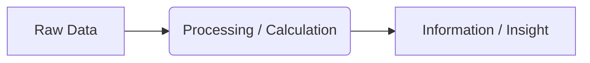

**Example:**

- **Data:** A list of temperature readings for a city over 5 days: `85, 90, 88, 92, 87`
    
- **Process:** Calculate the average temperature by adding the readings and dividing by 5.
    
- **Information:** The average temperature is `88.4` degrees, providing a meaningful insight into the overall weather patterns.

## Why Do We Need a Database?

A common question is:

> We already have a computer, an operating system, and a file system. Since files can store data, why do we need databases at all?

Before databases existed, applications used the file system directly to store data. This period is often called the **pre-database era** (around the 1960s).

Although storing data in files works, file systems have several limitations that become serious problems as applications grow. To solve these problems, **DBMS (Database Management System)** was introduced.

### What is DBMS?

**DBMS = Database Management System**

A DBMS is software that manages databases and provides an efficient way to store, retrieve, update, and secure data.

Instead of directly interacting with files, applications interact with the DBMS.

---

## How Data is Stored in a File System

Suppose we want to store student information:

|Serial|Name|Address|
|---|---|---|
|1|Arish|Sylhet|
|2|Rahim|Dhaka|

In a file system, we might save this data as:

- Text file (`.txt`)
    
- CSV file (`.csv`)
    
- Excel file (`.xlsx`)
    

Eventually, these files are stored on the computer's hard drive.

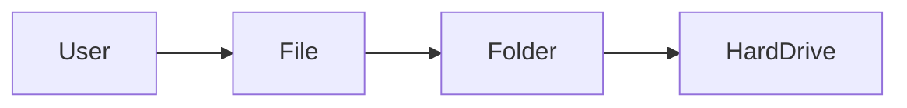

---

## Drawbacks of File Systems

### Multiple File Formats

The same type of data can be stored in many different formats.

For example:

- TXT
    
- CSV
    
- XLSX
    

This creates problems because each format may require different code to process.

In older systems, developers often had to write separate programs for each file format.

#### Problem

- Difficult to combine data from different formats
    
- More development effort
    
- Harder maintenance
    

---

### Data Redundancy

**Data Redundancy = Duplicate Data**

Suppose one file stores:

|Name|Address|
|---|---|
|Arish|Sylhet|

Another file stores:

|Name|Age|Address|
|---|---|---|
|Arish|20|Sylhet|

The address is stored in multiple places.

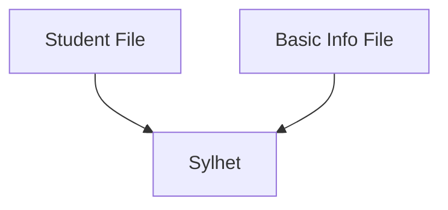

As the number of files grows, the amount of duplicated data increases significantly.

#### Problems

- More storage usage
    
- Harder maintenance
    
- Higher chance of mistakes
    

---

### Data Inconsistency

Data redundancy eventually leads to **data inconsistency**.

Suppose Arish moves from Sylhet to Dhaka.

You update one file:

|Name|Address|
|---|---|
|Arish|Dhaka|

But forget to update another file:

|Name|Address|
|---|---|
|Arish|Sylhet|

Now the same student has two different addresses.

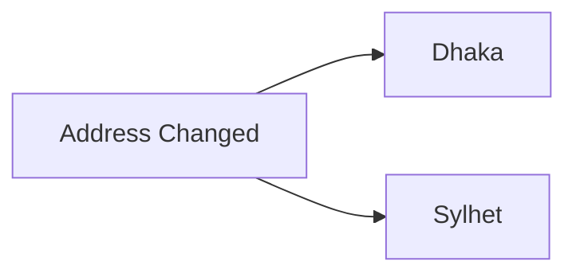

This is called **data inconsistency**.

#### Problems

- Incorrect information
    
- Conflicting records
    
- Reduced reliability
    

---

### Difficult Data Sharing

Suppose you share a file with 10 people.

Later, a student's address changes.

You update your own copy, but the other 9 copies still contain old information.

Some people may update their files, while others may forget.

As a result, different versions of the same data start appearing everywhere.

This creates even more inconsistency.

---

### No Proper Concurrency Control

**Concurrency** means multiple users trying to access or modify the same data simultaneously.

Example:

- User A updates a record
    
- User B updates the same record at the same time
    

Questions arise:

- Which update should happen first?
    
- Can both update together?
    
- What happens if both save different values?
    

File systems do not provide advanced mechanisms to handle these situations.

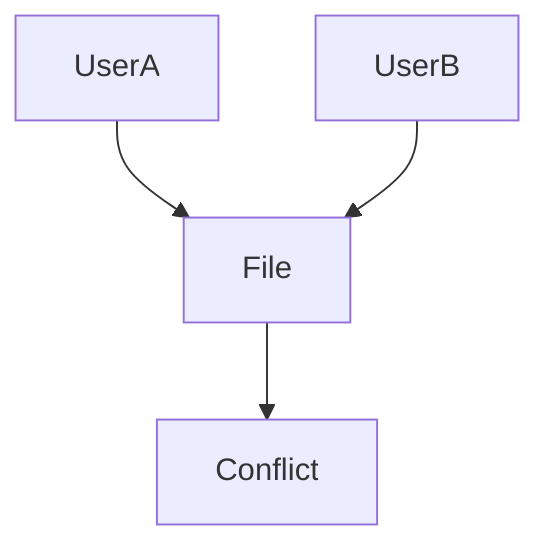

This can lead to conflicts and corrupted data.

---

### Security Limitations

File systems provide very limited access control.

If someone gets access to a file, they usually get access to the entire file.

Example:

|Column|Access|
|---|---|
|Name|Allowed|
|Address|Restricted|

A file system cannot easily enforce this level of control.

A DBMS can.

With a database, we can:

- Allow users to view specific columns
    
- Hide sensitive data
    
- Allow read-only access
    
- Prevent updates and deletes
    
- Define role-based permissions
    

This is known as **fine-grained access control**.

---

## How DBMS Solves These Problems

Instead of directly working with files, applications communicate with a DBMS.

When data needs to be stored:

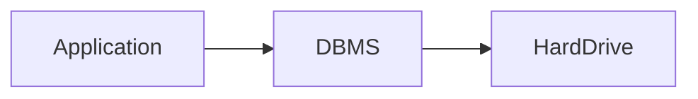

When data needs to be retrieved:

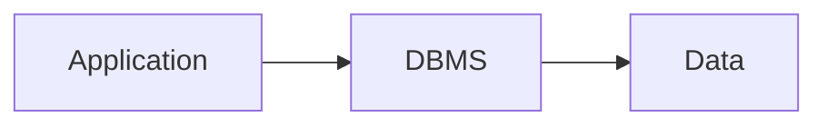

The DBMS handles:

- File organization
    
- Storage format
    
- Data retrieval
    
- Performance optimization
    
- Security
    
- Concurrency control
    
- Consistency management
    

Developers only focus on working with data.

The DBMS handles everything else behind the scenes.

---

## File System vs DBMS

|Feature|File System|DBMS|
|---|---|---|
|Data Redundancy|High|Low|
|Data Consistency|Difficult|Maintained|
|Concurrency Control|Poor|Strong|
|Security|Basic|Advanced|
|Data Retrieval|Manual|Efficient|
|Scalability|Limited|High|
|Data Relationships|Difficult|Built-in|

---

## Popular Types of DBMS

### Relational Databases (RDBMS)

Store data in tables with rows and columns.

Examples:

- MySQL
    
- PostgreSQL
    
- SQLite
    
- SQL Server
    

### Document Databases

Store data as documents (usually JSON-like structures).

Examples:

- MongoDB
    
- DynamoDB
    

### Key-Value Databases

Store data as key-value pairs.

Example:

- Redis
    

---

## Summary

File systems can store data, but they introduce several problems:

- Multiple file formats
    
- Data redundancy
    
- Data inconsistency
    
- Difficult sharing
    
- Weak concurrency handling
    
- Limited security
    

To solve these issues, **Database Management Systems (DBMS)** were introduced.

A DBMS sits between the application and the hard drive, managing storage, retrieval, security, consistency, and concurrency efficiently.

That is why modern applications use databases instead of directly storing data in files.

## Database Models and Why Relational Databases Became So Popular

In this lesson, we'll discuss different database models and understand why the **Relational Model** became the most popular and widely used database model.

### Evolution of Database Models

Database models did not appear in the following order:

1. Hierarchical Model
    
2. Network Model
    
3. Relational Model
    
4. Document-Based Model
    
5. Key-Value Model
    

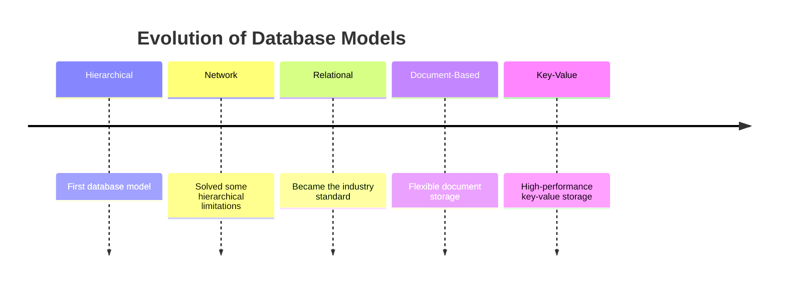

---

## Hierarchical Model

The **Hierarchical Model** was one of the earliest database models.

In this model, data relationships were represented as a **tree structure**, where every child node had exactly one parent.

### Example


This model works well when relationships naturally form a hierarchy.

### Main Limitation

A child node could not have multiple parents.

Suppose:

- Mejbhai teaches Express
    
- Mir Vai also teaches Express
    

The hierarchical model cannot represent this relationship because a node can only have one parent.

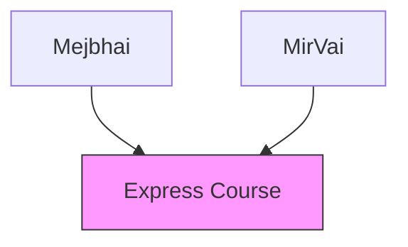

This relationship is not supported in a pure hierarchical model.

---

## Network Model

To solve the limitations of the hierarchical model, the **Network Model** was introduced.

Unlike the hierarchical model, a node could have multiple parents.

### Example

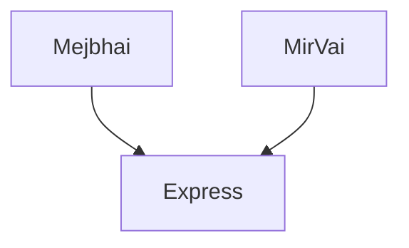

Now the relationship can be represented correctly.

### Advantages

- Supports multiple parent-child relationships
    
- More flexible than the hierarchical model
    

### Drawbacks

Despite being more powerful, it introduced new problems.

#### Complex Data Traversal

To find data, the system often had to traverse multiple nodes and relationships.

As data grew larger, finding information became increasingly complex.

#### Complex Schema Design

Defining and maintaining relationships was difficult.

#### Lack of Standardization

There was no standard way to interact with the database.

Different vendors implemented different approaches.

As a result:

- Learning was difficult
    
- Development was difficult
    
- Portability was poor
    

---

## Relational Model

The **Relational Model** solved many of the problems of previous database models.

Instead of trees and graphs, data is stored in **tables**.

### User Table

|UID|Name|Address|Phone|
|---|---|---|---|
|1|Nadira|Dhaka|017xxxx|
|2|Arish|Sylhet|018xxxx|
|3|Rahil|Chattogram|019xxxx|
|4|Arish|Cumilla|016xxxx|

### Order Table

|OID|Product|Price|UID|
|---|---|---|---|
|1|Product A|500|2|
|2|Product B|800|1|
|3|Product C|1200|3|

---

## Unique Identifiers (IDs)

In relational databases, each row is usually assigned a unique identifier.

Examples:

- `UID` → User ID
    
- `OID` → Order ID
    

These IDs help us uniquely identify a record.

### Why IDs Are Important

Notice that there are two users named **Arish**.

|UID|Name|
|---|---|
|2|Arish|
|4|Arish|

If we search by name, we may get multiple results.

However, if we search by:

```txt
UID = 2
```

We get exactly one record.

This removes ambiguity and makes data retrieval reliable.

---

## How Relationships Work in Relational Databases

A common question is:

> Earlier models showed relationships using parent-child trees. How are relationships represented in relational databases?

The answer is: **Keys**.

### Relationship Example

#### Users

|UID|Name|
|---|---|
|1|Nadira|
|2|Arish|
|3|Rahil|

#### Orders

|OID|Product|UID|
|---|---|---|
|1|Product A|2|
|2|Product B|1|
|3|Product C|3|

The `UID` inside the Orders table points to a user in the Users table.

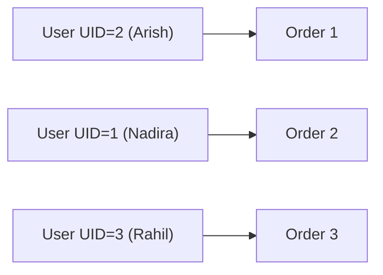

### Example Query Logic

Suppose we look at:

```txt
Order 1
UID = 2
```

We go to the User table and find:

```txt
UID = 2 → Arish
```

Therefore:

```txt
Order 1 belongs to Arish
```

This is how relationships are maintained in relational databases.

---

## Why Relational Databases Became Popular

### Table-Based Structure

Data is easy to understand because everything is organized into rows and columns.

### Unique Identification

Each row can be uniquely identified using IDs.

### Relationships Through Keys

Relationships are created using keys instead of complex tree traversals.

### Faster Data Retrieval

Databases can create indexes on keys.

Because of indexing, the database can locate data quickly without traversing every record.

### Easier Schema Design

Tables, columns, and relationships are easier to design and maintain.

### Standardized Query Language

Relational databases introduced SQL (Structured Query Language).

This gave developers a standard way to:

- Store data
    
- Retrieve data
    
- Update data
    
- Delete data
    

Regardless of whether they used MySQL, PostgreSQL, SQLite, or SQL Server.

---

## Comparison of Database Models

|Feature|Hierarchical|Network|Relational|
|---|---|---|---|
|Tree Structure|✅|❌|❌|
|Multiple Parents|❌|✅|✅|
|Easy Relationships|❌|⚠️|✅|
|Easy Data Retrieval|❌|⚠️|✅|
|Standard Query Language|❌|❌|✅|
|Scalability|⚠️|⚠️|✅|

---

## Summary

### Hierarchical Model

- Tree-based structure
    
- Child can only have one parent
    
- Limited flexibility
    

### Network Model

- Supports multiple parents
    
- More flexible
    
- Complex to manage
    
- No standard interaction method
    

### Relational Model

- Stores data in tables
    
- Uses unique identifiers (IDs)
    
- Creates relationships through keys
    
- Supports indexing
    
- Easier schema design
    
- Standardized through SQL
    

These advantages made the **Relational Model** the dominant database model used today.


## Anatomy of a Table in the Relational Model

One of the most important components of a **Relational Database** is the **Table**.

In the relational model, data is stored in a structured format using tables.

In this lesson, we'll learn the anatomy of a table and understand the terminology used in relational databases.

---

## Table (Relation)

In a relational database, data is stored in tables.

Example:

|ID|Name|Email|DOB|Phone|
|---|---|---|---|---|
|1|Arish|[arish@gmail.com](mailto:arish@gmail.com)|2000-01-15|017xxxx|
|2|Rahil|[rahil@gmail.com](mailto:rahil@gmail.com)|2001-03-20|018xxxx|

This structure is called a **Table**.

A table is also called a **Relation**.

Therefore:

```txt
Table = Relation
```

Both terms are interchangeable in relational database theory.

---

## Entity

A table usually represents an **Entity**.

An entity is a real-world or conceptual object that we want to store information about.

### Real-Life Entity Example

```txt
User
```

A User exists in the real world, so it is a real-life entity.

The table below represents the User entity:

|ID|Name|Email|
|---|---|---|
|1|Arish|[arish@gmail.com](mailto:arish@gmail.com)|
|2|Rahil|[rahil@gmail.com](mailto:rahil@gmail.com)|

---

### Conceptual (Imaginary) Entity Example

```txt
Order
```

An Order is not a physical object like a person.

However, it is still something we want to track and store information about.

Therefore, it is also considered an entity.

Example:

|Order ID|Product|Price|
|---|---|---|
|101|Laptop|50000|
|102|Phone|25000|

---

### Relationship Between Entity and Table

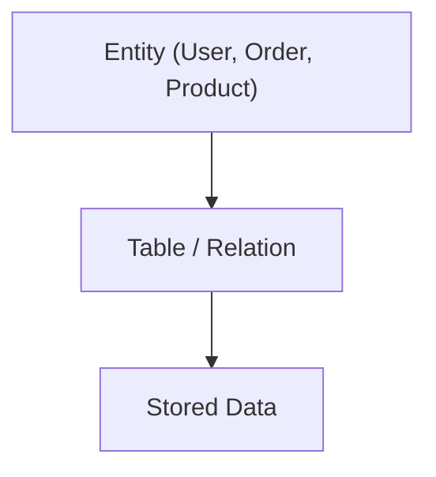

A table is simply the database representation of an entity.

---

## Columns (Attributes)

Consider the following table:

|ID|Name|Email|DOB|Phone|
|---|---|---|---|---|
|1|Arish|[arish@gmail.com](mailto:arish@gmail.com)|2000-01-15|017xxxx|

The vertical sections:

- ID
    
- Name
    
- Email
    
- DOB
    
- Phone
    

are called **Columns**.

Columns are also called **Attributes**.

```txt
Column = Attribute
```

Both terms mean the same thing.

### Example

|Column|Attribute|
|---|---|
|ID|ID|
|Name|Name|
|Email|Email|
|DOB|DOB|
|Phone|Phone|

---

## Domain and Constraints

Each column can define what type of data is allowed.

This restriction is called a **Constraint** or **Domain**.

---

### Example: Email Column

Suppose we have:

|Email|
|---|
|[arish@gmail.com](mailto:arish@gmail.com)|

The Email column should only accept email values.

Valid:

```txt
arish@gmail.com
rahil@yahoo.com
```

Invalid:

```txt
12345
hello
2024-05-01
```

So we can say:

```txt
Email Column Domain = Email Values
```

---

### Example: Date of Birth (DOB)

|DOB|
|---|
|2000-01-15|

Valid:

```txt
2000-01-15
1998-10-20
```

Invalid:

```txt
Hello
ABC
123XYZ
```

The column only accepts values that follow a valid date format.

---

### Domain Concept

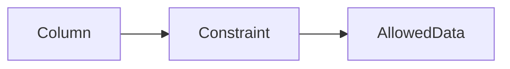

Examples:

|Column|Domain|
|---|---|
|Email|Email Format|
|DOB|Date Format|
|Age|Integer|
|Name|Text/String|

---

## Rows (Tuples / Records)

Consider the following table:

|ID|Name|Email|
|---|---|---|
|1|Arish|[arish@gmail.com](mailto:arish@gmail.com)|
|2|Rahil|[rahil@gmail.com](mailto:rahil@gmail.com)|
|3|Nadira|[nadira@gmail.com](mailto:nadira@gmail.com)|

Each horizontal line is called a **Row**.

Example:

|ID|Name|Email|
|---|---|---|
|1|Arish|[arish@gmail.com](mailto:arish@gmail.com)|

This single line is a row.

Rows are also called:

- Tuple
    
- Record
    

```txt
Row = Tuple = Record
```

These terms are often used interchangeably.

---

### Example

This is one row:

|ID|Name|Email|
|---|---|---|
|2|Rahil|[rahil@gmail.com](mailto:rahil@gmail.com)|

We can call it:

- A Row
    
- A Tuple
    
- A Record
    

All three are correct.

---

## Visualizing Table Components

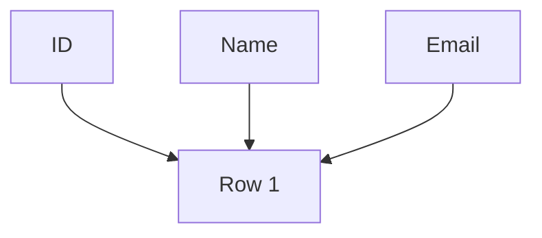

- Vertical structure → Columns (Attributes)
    
- Horizontal structure → Rows (Tuples / Records)
    

---

## Cardinality

Cardinality refers to the total number of rows in a table.

### Example

|ID|Name|
|---|---|
|1|Arish|
|2|Rahil|
|3|Nadira|
|4|Fahim|

This table contains:

```txt
4 Rows
```

Therefore:

```txt
Cardinality = 4
```

---

### Another Example

|ID|Name|
|---|---|
|1|Arish|
|2|Rahil|
|3|Nadira|
|4|Fahim|
|5|Hasan|
|6|Karim|

Here:

```txt
Cardinality = 6
```

A higher cardinality means the table contains more records.

---

## Degree

Degree refers to the total number of columns in a table.

Consider:

|ID|Name|Email|DOB|Phone|
|---|---|---|---|---|

There are 5 columns.

Therefore:

```txt
Degree = 5
```

---

### Another Example

|ID|Name|Email|
|---|---|---|

This table contains:

```txt
3 Columns
```

Therefore:

```txt
Degree = 3
```

---

## Cardinality vs Degree

|Term|Meaning|
|---|---|
|Cardinality|Number of Rows|
|Degree|Number of Columns|

### Example

|ID|Name|Email|
|---|---|---|
|1|Arish|[arish@gmail.com](mailto:arish@gmail.com)|
|2|Rahil|[rahil@gmail.com](mailto:rahil@gmail.com)|
|3|Nadira|[nadira@gmail.com](mailto:nadira@gmail.com)|
|4|Fahim|[fahim@gmail.com](mailto:fahim@gmail.com)|

- Number of rows = 4
    
- Number of columns = 3
    

Therefore:

```txt
Cardinality = 4
Degree = 3
```

---

## Summary

### Table / Relation

- Stores data in relational databases
    
- Represents an entity
    

### Entity

- Real-world or conceptual object
    
- Examples:
    
    - User
        
    - Product
        
    - Order
        

### Column / Attribute

- Vertical part of a table
    
- Describes a property of an entity
    

### Domain / Constraint

- Defines what type of data can be stored in a column
    

### Row / Tuple / Record

- Horizontal part of a table
    
- Represents one complete piece of data
    

### Cardinality

- Total number of rows in a table
    

### Degree

- Total number of columns in a table
    

### Important Equivalences

```txt
Table = Relation

Column = Attribute

Row = Tuple = Record

Cardinality = Number of Rows

Degree = Number of Columns
```


---
## Candidate Key

This video explains candidate keys and builds the idea using set theory concepts like subset and proper subset.

---

## Set, Subset, Proper Subset (foundation)

Let,

**A = {1, 2, 3}**

### Subset

A subset can include all elements or some elements of the original set.

Examples:

- {1}
    
- {2}
    
- {1, 2}
    
- {1, 2, 3}
    
- ∅
    

So:

- {1, 2, 3} is also a subset of itself
    

---

### Proper Subset

A proper subset must have **fewer elements than the original set**.

Examples:

- {1} ⊂ {1, 2, 3}
    
- {1, 2} ⊂ {1, 2, 3}
    
- ∅ ⊂ {1, 2, 3}
    

Important:

- A set is **not** a proper subset of itself
    

Rule:

- Every proper subset is a subset
    
- But not every subset is a proper subset
    

---

## Candidate Key Definition

A candidate key is:

> A super key whose proper subset is not a super key

Or more simply:

> A minimal super key

---

## Meaning in simple terms

- Super key → can uniquely identify a row
    
- Candidate key → uniquely identifies a row, and cannot be reduced further
    

If you remove any attribute and it still remains unique → it is NOT a candidate key.

---

## Example Table

User table:

| UID | Name | Email | Gender |

---

## Super Key examples (from lecture)

- UID
    
- Email
    
- UID + Name
    
- UID + Email
    
- Name + Gender
    

---

## Checking Candidate Keys

### 1. UID

Set: {UID}

Proper subset:

- ∅
    

Since ∅ is not a super key:

- UID is a candidate key ✔
    

---

### 2. Email

Assuming email is unique and not null:

Proper subset:

- ∅
    

Not a super key → valid

So:

- Email is a candidate key ✔
    

---

### 3. UID + Name

Set: {UID, Name}

Proper subsets include:

- {UID}
    
- {Name}
    
- ∅
    

Problem:

- {UID} is already a super key
    

So:

- UID + Name is NOT a candidate key ✘
    

---

### 4. UID + Email

Problem:

- UID alone is already a super key
    
- Email alone can also be a super key
    

So:

- UID + Email is NOT a candidate key ✘
    

---

### 5. Name + Gender

Set: {Name, Gender}

Proper subsets:

- {Name}
    
- {Gender}
    
- ∅
    

Check:

- None of these are super keys (in this dataset)
    

So:

- Name + Gender is a candidate key (only for this dataset) ✔
    

Important:

- This may fail in real systems if duplicates exist
    

---

## Key Insight

Candidate keys are **data-dependent**:

- They are valid only if they guarantee uniqueness in the actual dataset
    
- Not just theoretical combinations
    

---

## Why “Minimal Super Key”

Because:

- A candidate key cannot be reduced further
    
- If any subset still works as a super key → it is not minimal
    

---

## Primary Key Relation

- Candidate keys = all possible unique minimal identifiers
    
- Primary key = one selected candidate key
    

Selection criteria:

- smallest
    
- stable
    
- least likely to change
    

---

## Flow

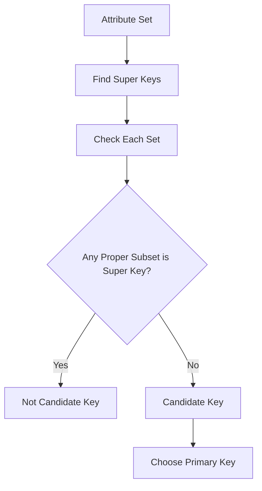